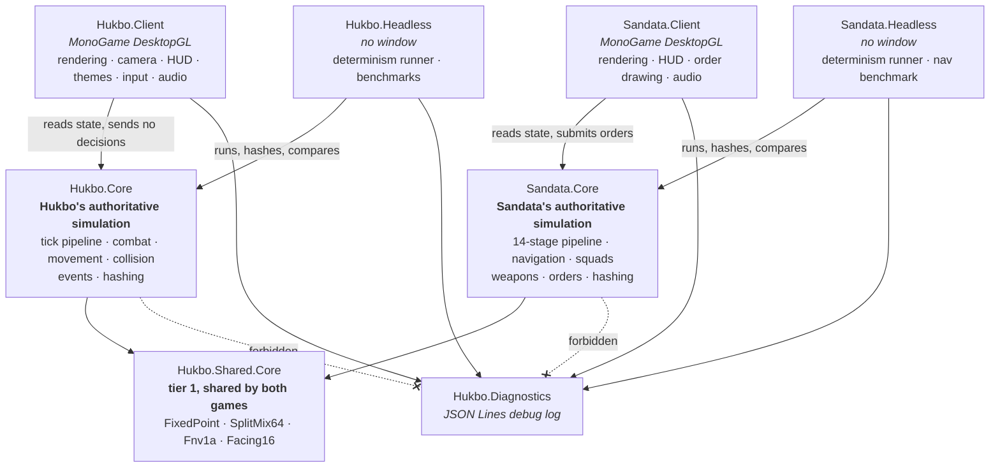

<div align="center">

# Hukbo

**A deterministic, offline battle simulator of pre-colonial Philippine warfare.**

Two autonomous factions meet on an open field. You do not command them — you
watch, pause, inspect any warrior, and replay the exact same battle as many
times as you like.

[](global.json)
[](Directory.Packages.props)
[](src)
[](docs/platform-support-matrix.md)

[](docs/development/testing.md)
[](SIMULATION-GAME-STANDARDS.md)
[](scripts/verify.ps1)
[](#offline-by-design)
[](#direction)

[Run it](#run-the-game) ·
[Sandata](#the-second-game-sandata) ·
[Controls](#controls) ·
[Determinism](#determinism) ·
[Architecture](#architecture) ·
[History policy](#historical-accuracy) ·
[Docs](#documentation)

</div>

---

## What this is

Hukbo is a 2D spectator battle built with .NET 10 and MonoGame DesktopGL. Two
autonomous factions fight without player input. Every decision — who to target,
whether a blow lands, where it lands, who dies — is made by the simulation, and
the same seed on the same build produces a byte-identical battle every time.

| | |
| --- | --- |
| **Nobody is driving** | Both factions are autonomous. There are no orders, no unit selection, no player side. The spectator controls time and the camera, never the battle. |
| **The same seed is the same battle** | Integer ticks, fixed-point math, a pinned SplitMix64 stream, and a total order on every query. Same seed plus same build gives the same state hash, event hash, winner, and ordered event stream. |
| **It runs with the network cable out** | No telemetry, no accounts, no content downloads, no hosted CI. The build, the tests, and the game are fully offline. |
| **The history is labelled, not asserted** | Every cultural claim carries an evidence tier. Weapons and ranks appear in pair form — `Kampilan — Great Blade`, `Timawa — Bound Freeman` — never as a bare label. |

## Direction

Hukbo is being built toward a 4X strategy game about warfare in the
pre-colonial and early-contact Philippines, roughly the 1500s. What exists today
is the tactical layer of that game: a deterministic battle that a future
campaign layer will configure and score.

| Layer | Status |
| --- | --- |
| **Tactical battle** — autonomous factions, spectator controls, deterministic replay | shipped as v0.1 |
| **Campaign** — explore islands, expand polities, exploit trade, exterminate rivals | not started |

The campaign layer is gated behind Gate 3 in
[Simulation game standards](SIMULATION-GAME-STANDARDS.md): scenario, snapshot,
replay verification, save and resume equivalence, and a reported 500-agent
stress result. Until that gate passes, no campaign, economy, or diplomacy state
enters `Hukbo.Core`. When the campaign layer does start, it becomes a separate
project that *produces* `Scenario` values and *consumes* `BattleOutcome`. The
battle core never learns what a barangay is.

## The second game: Sandata

Since August 2026 this repository builds two games rather than one.

**Sandata** is a top-down modern tactical game — room clearing in the Door
Kickers tradition, in which small squads move through an interior map, and in
which both autonomous squad behaviour and hand-drawn player orders are
first-class. It is in development and has no v0.1 yet.

It is a separate product, not a Hukbo mode and not a fork. It has its own
simulation, its own fourteen-stage tick pipeline, its own ruleset and preset
stream, its own map format, and its own pair of hashes. The two games share
exactly one project, `src/Hukbo.Shared.Core`, which holds four pure integer
determinism primitives — `FixedPoint`, `SplitMix64`, `Fnv1a`, and `Facing16` —
and nothing that knows what an agent, an operator, a weapon, or a map is.

Sandata runs at 50 Hz rather than Hukbo's 20 Hz, because a gunfight's timing
chain is measured in tens of milliseconds; a pistol's 80-millisecond ready time
is 1.6 ticks at 20 Hz and exactly 4 ticks at 50 Hz. Its distance unit is the
world unit, with 1 metre equal to 16 of them.

```powershell
./scripts/run.ps1 -Game Sandata
```

Its design document is
[`docs/plans/2026-08-07-sandata-scaffold-design.md`](docs/plans/2026-08-07-sandata-scaffold-design.md)
and its plan document is
[`docs/plans/2026-08-07-sandata-scaffold.md`](docs/plans/2026-08-07-sandata-scaffold.md).
Two things about it are still open questions rather than decisions: the name
`Sandata` itself, and whether shipped display strings use real weapon names or
generic aliases.

## Run the game

Requirements: Windows x64, PowerShell 7, Git, and .NET SDK 10.0.302 (pinned in
[`global.json`](global.json)).

```powershell
git clone https://github.com/boazcstrike/hukbo.git
cd hukbo
./scripts/bootstrap.ps1     # prerequisite checks and a locked restore
./scripts/run.ps1           # launch
```

The fallback launch command, if you would rather skip the scripts:

```powershell
dotnet run --project src/Hukbo.Client -c Release
```

The game starts paused. Press Play, or press Space.

<details>
<summary><b>Every supported script</b></summary>

```powershell
./scripts/bootstrap.ps1                        # prerequisites and locked restore
./scripts/run.ps1                              # launch the game
./scripts/verify.ps1                           # the canonical gate
./scripts/verify.ps1 -SkipBootstrap            # the gate without re-restoring
./scripts/test.ps1 -Configuration Release      # tests only
./scripts/format.ps1 -Verify                   # formatting check only
./scripts/benchmark.ps1 -Agents 200 -Ticks 10000 -Seed 1
./scripts/package.ps1 -Runtime win-x64         # self-contained client
./scripts/doctor.ps1                           # diagnose a broken environment
./scripts/sfx.ps1 -List                        # sound slots and which have a file
```

Every game-specific script takes `-Game`, validated to `Hukbo` or `Sandata` and
defaulting to `Hukbo`, so a command with no `-Game` runs exactly what it ran
before the second game existed:

```powershell
./scripts/run.ps1 -Game Sandata
./scripts/test.ps1 -Configuration Release -Game Sandata
./scripts/benchmark.ps1 -Game Sandata -Seed 1
./scripts/package.ps1 -Runtime win-x64 -Game Sandata
./scripts/verify.ps1 -Game Sandata
```

The project paths live in one table, `scripts/_gametargets.ps1`, and no script
body hardcodes a project path; tests assert both halves of that. `build.ps1`,
`format.ps1`, and `bootstrap.ps1` take no `-Game` because they act on the whole
solution, and `doctor.ps1` takes none because it checks every project's lock
file rather than one game's.

`scripts/` holds the only supported entry points. `tools/` holds hand-run
measurement harnesses; they are not in the solution and not in the gate.

</details>

## Controls

| Input | Action |
| --- | --- |
| `Escape` | Open or close the control menu |
| `Space` | Toggle play and pause while the menu is closed |
| `1` `2` `4` | Set simulation speed |
| `R` | Start the next round, advance the deterministic seed, and pause |
| `Shift+R` | Reset to 0-0, seed 1, 1x, camera fit, and a paused match |
| `WASD` or arrow keys | Pan the camera |
| Mouse wheel over the arena | Zoom |
| Mouse wheel over the event log | Scroll battle-event history |
| Click a warrior | Select it for persistent inspection |
| Click empty arena | Clear the selection |
| `F9` | Show or hide the sound log panel |
| `Tab` / `Shift+Tab` | Move keyboard focus forward and backward inside the menu |
| Arrow keys or `WASD` in the menu | Move keyboard focus between menu controls |
| `Enter` | Activate the focused menu control |

On-screen controls: **Play** resumes and, from the modal, also closes the menu.
**Pause** pauses and, from the modal, leaves the menu visible. **Menu** pauses
and opens the modal. The modal carries **Next Round**, **Full Reset**, and
**Exit Game**.

<details>
<summary><b>What the spectator layer guarantees</b></summary>

- Play, Pause, and Menu stay visible above the arena at all times.
- The selected-agent inspector retains a dead warrior's final authoritative
  state, so a death can be read after the fact.
- The battle event feed retains at most 200 ordered events.
- A terminal summary shows the winner, survivors, tick, simulated duration,
  seed, and Next Round.
- Opening the menu pauses logical simulation advancement.
- The HUD and the window title show session-local wins for Team A (Blue) and
  Team B (Red).
- **Next Round** records exactly one win for the outgoing terminal victor,
  advances to a distinct deterministic seed, clears disposable presentation
  state, and starts paused while preserving score, speed, and camera. An
  abandoned round or a draw adds no win, but still advances the seed.
- **Full Reset** clears both win totals, restores seed 1 and 1x speed, fits the
  camera, clears disposable presentation state, and starts paused.

</details>

## What the simulation models

Everything below lives in `Hukbo.Core`, reaches the state hash, and is
reproducible from a seed. None of it is presentation.

**Combat.** An attack is resolved against a target's defences and then against
a hit location. The five outcomes are `Landed`, `ShieldBlocked`, `Parried`,
`Deflected`, and `Evaded`; the seed-1 gate run above resolves 2 244 accepted
attacks into 1 671 landed blows with roughly a quarter of the remainder
attributable to defence. A landed blow picks one of thirteen body parts —
weapon arm, shield arm, shoulder, head, neck, face, chest, abdomen, thigh,
knee, shin, hands, feet — and that part is recorded on the battle event and
decides which impact sound plays. It is metadata only: damage comes from the
attacker's weapon profile alone, and the location struck changes no damage,
health capacity, cooldown, later action, or death. There is no per-part health,
wound, or crippling model.
Landed blows can open a combination chain whose maximum length depends
on the fighter, and a live chain shortens the attack cooldown.

**Equipment.** Four fielded weapons — Kampilan, Wasay, Kalis, Itak — each with
its own damage, reach, and cooldown, carried either alone or paired with a
`TallHardwood` shield. Armour is a single `LightOrganic` entry. Weapon and
shield identities are numbered and pinned: renumbering one is a content-hash
change, not an edit.

**Rank.** Four ranks — Datu, Maharlika, Timawa, Aliping Namamahay — select
clash profiles and roster composition. Rank carries no combat-strength bonus of
its own, for the reason given under [Historical accuracy](#historical-accuracy).

**Movement and formation.** Warriors hold a tactical posture (`Advance`,
`Hold`, `Yield`, `Regroup`, `Pursue`, `Withdraw`) and step through a footwork
lifecycle (`Approach`, `Engage`, `Commit`, `Recover`, `Refuse`, `Disengage`,
`Regroup`, `Pursue`) with sixteen-way facing. Contingents hold formation and
latch on contact, a rally corridor pulls stragglers back, a stall-escape rule
breaks a deadlock that has lasted 192 ticks, an approach sidestep keeps
warriors from queueing single file into the same gap, and a faction reduced to
six or fewer survivors falls into a last stand.

**Collision.** A uniform grid produces candidate pairs, a fairness rule orders
contested moves, and penetration is held at zero — the seed-1 run reports
98 076 candidate pairs, 6 020 contacts, 84 515 accepted moves, and a maximum
penetration of 0. There is no rigid-body physics; distance checks and hitscan
are the model.

### Rulesets and versions

Rulesets are versioned rather than edited, so an old replay keeps reproducing.
Every earlier version stays registered and unmodified.

| Ruleset | Versions | Default | What the newest version added |
| --- | --- | --- | --- |
| Combat preset | V1 – V4 | **V4** | Rank identity, per-rank clash profiles |
| Movement preset | V1 – V6 | **V4** | Equipment-relative footwork (V6) |

The movement default deliberately lags the newest registered preset. V6 is
built and tested, and a `Scenario` can name it, but the client never does: the
default only moves once a battle under the newer preset terminates inside the
tick budget, and it does not yet. The measured evidence is in
[`docs/plans/`](docs/plans/) — see the movement V7 baseline and calibration
records, which located the cause upstream of the tuning that was tried.

## What the client shows and hears

The client draws what the simulation already decided, and nothing here can
change an outcome.

**Panels.** Agent inspector, filterable battle event log with per-event detail,
army composition editor with steppers, a battle report carrying per-faction
combat metrics, a terminal match summary, and a sound log (`F9`). Warriors
carry personal names drawn client-side from the researched sixteenth-century
pool in
[`docs/names/HISTORICAL_1500s_PERSONAL_NAMES.md`](docs/names/HISTORICAL_1500s_PERSONAL_NAMES.md).

**Effects.** Blood, dust, trample marks, grass sway over a plains backdrop,
swing animation posed per weapon, and shield-clash effects. A detail-tier gate
and conservative culling keep the effect load bounded at high agent counts.

**Audio.** 70 generated sound files: 40 attack cues keyed by weapon and body
region, 16 shield-clash cues, 10 death lines, per-faction victory, a draw cue,
and a UI click. A voice ledger and a cue budget cap simultaneous playback so a
mass casualty does not become noise.

**Themes and settings.** Six themes — `command`, `field-manual`, `signal`,
`broadcast`, `high-contrast`, and the default `datu-court` — each filling the
same set of semantic colour roles rather than hard-coded colours. Choices
persist to `%LOCALAPPDATA%\Hukbo\settings.json` (schema version 8): selected
theme, army composition, gore intensity (`Off`, `Stylized`, `Full`), motion
intensity (`Off`, `Reduced`, `Full`), auto-camera mode (`Off`, `Assisted`,
`Follow`), UI scale (`Auto`, 100%, 125%, 150%, 200%), and startup display mode
(windowed or fullscreen).

## Determinism

Determinism is the load-bearing property of this repository, not a nice
property it happens to have. The full contract is §4 of
[Simulation game standards](SIMULATION-GAME-STANDARDS.md).

| Rule | Why |
| --- | --- |
| Authoritative time is an integer tick | Wall-clock time is not reproducible |
| Fixed tick-stage order | Incidental call order must never decide an outcome |
| Every multi-result query has a total order | Ties break on stable `EntityId` |
| `System.Random` is banned | Its sequence is not guaranteed across .NET majors — `Determinism/SplitMix64.cs` is |
| Fixed-point math for anything hashed | `Mathematics/FixedPoint.cs`; floating point drifts |
| Hash-set iteration order may not reach gameplay | Enumeration order is an implementation detail |

Two independent hashes are computed over each run: a **state hash** over
authoritative simulation state and an **event hash** over the ordered event
stream. Changing an enum value, an enum's order, a roster, a weight, or a hash
mixer requires a **new preset version** plus new golden expectations — the old
preset stays registered and unmodified so its replays keep reproducing.

Latest Hukbo gate run on this machine, 200 agents, 10,000 requested ticks,
seed 1, 2026-08-09:

```
Core     Total tests: 2376   Passed: 2376
Client   Total tests: 3270   Passed: 3270
measuredTicks 981   outcome Faction1Victory   survivors 0 / 6
stateHash 1B73FC5923879AA0   eventHash AC55684F24D39344   deterministic true
coreAllocatedBytes 154976   p50 0.1297 ms   p95 0.9696 ms   p99 1.3251 ms
```

Sandata computes its own two hashes over its own state and its own event stream.
Its gate run on the same day, 200 operators over 10,000 ticks at seed 1:

```
Core     Total tests: 1104   Passed: 1104
Client   Total tests:  199   Passed:  199
measuredTicks 10000   outcome Ongoing   survivors 70 / 64
stateHash BDD56EBD06F76674   eventHash 7C1B37876769DEC7   deterministic true
p50 2.6383 ms   p95 4.6475 ms   p99 6.8726 ms
```

## Verify the repository

```powershell
./scripts/verify.ps1
```

The canonical gate runs five stages in order:

1. prerequisite validation and a locked restore;
2. formatting verification;
3. Release solution build;
4. Core and GPU-independent Client tests;
5. a 200-agent, 10,000-tick, seed-1 headless determinism workload.

**With no `-Game` flag the gate runs Hukbo only.** Sandata has its own
invocation, which runs the same five stages against Sandata's two test suites
and Sandata's headless workload:

```powershell
./scripts/verify.ps1 -Game Sandata
```

The default gate deliberately stays on the Hukbo workload alone until Sandata's
seed-1 baseline has settled, so that a red Sandata run can never be mistaken for
a red Hukbo one. The corollary matters more: **a green `./scripts/verify.ps1` is
not evidence about Sandata**, because without the flag the gate never built or
ran a line of it. Report the two results separately or not at all.

**Verification is deliberately local-only.** This repository has no GitHub
Actions workflow and no hosted CI service, and it is not going to acquire one.
Run the gate on the integration workstation and record its exact output.
Interactive behavior is proven only by the manual checklist in
[`docs/development/testing.md`](docs/development/testing.md) — compiling is not
a passing test run, and a passing test run is not a smoke check.

Package the self-contained Windows client with:

```powershell
./scripts/package.ps1 -Runtime win-x64
```

Output lands in `artifacts/packages/client-win-x64/`.

## Architecture

Twelve projects, all in `Hukbo.slnx`.



| Project | Responsibility |
| --- | --- |
| `src/Hukbo.Shared.Core` | Tier 1. Four pure integer determinism primitives shared by both games and nothing else. |
| `src/Hukbo.Core` | Hukbo's authoritative simulation. Tick pipeline, agents, combat, movement, collision, events, RNG, hashing. |
| `src/Hukbo.Client` | Hukbo's MonoGame shell. Rendering, camera, UI, themes, input, audio. |
| `src/Hukbo.Headless` | Hukbo's determinism and benchmark runner. No window. |
| `src/Sandata.Core` | Sandata's authoritative simulation. Fourteen-stage pipeline, navigation, squads, sensing, weapons, orders, hashing. |
| `src/Sandata.Client` | Sandata's MonoGame shell. Rendering, HUD, order drawing, themes, audio. |
| `src/Sandata.Headless` | Sandata's determinism runner and navigation benchmark. No window. |
| `src/Hukbo.Diagnostics` | JSON Lines debug log shared by every client and headless runner. |
| `tests/` | `Hukbo.Core.Tests`, `Hukbo.Client.Tests`, `Sandata.Core.Tests`, `Sandata.Client.Tests` |
| `scripts/` | The only supported entry points. PowerShell 7. |
| `docs/` | Design, plans, research, agent-role evidence. |

Four boundaries are enforced by tests, not by convention:

- **Neither `Hukbo.Core` nor `Sandata.Core` may reference** MonoGame, the
  filesystem, the network, windowing, audio, the wall clock, or
  `Hukbo.Diagnostics`. A simulation is denied the filesystem and the clock; the
  logger needs both. Observe it from outside, reading state the caller already
  holds.
- **Neither client may decide** targeting, damage, retreat, or victory. Each
  draws what its simulation already decided.
- **`Hukbo.Shared.Core` holds four files and stays that way.** Anything that
  knows what an agent, an operator, a weapon, a tick stage, or a map is belongs
  to one game. A change to a tier-1 file moves both games' hashes at once, which
  is exactly why the boundary is drawn at "no game concepts" rather than at
  "code we happen to use twice".
- **The two games do not reach into each other.** No `Sandata.*` project
  references a `Hukbo.Core` or `Hukbo.Client` type, and no `Hukbo.*` project
  references a `Sandata.*` type.

A tier-2 extraction — a shared client project for presentation code the two
clients duplicate — is deferred with its boundary written down rather than
built, and is one of the repository's open design questions.

Client presentation tests never construct an `ArenaGame`, a graphics device, a
sprite batch, or a window, and never depend on GPU, audio, focus, network, or
the wall clock. That is what lets Hukbo's 3 270 presentation tests finish in
about two seconds. Sandata's 1 104 core tests take about 38 seconds, roughly
half of that in the handful of cases that run its navigation benchmark end to
end.

## Debug logging

A `Debug` run writes `artifacts/logs/hukbo-<utc>-<pid>.jsonl` with no flags at
all — one JSON object per line, so a run leaves behind a record an agent or a
teammate can read without having watched the screen.

```powershell
./scripts/run.ps1 -Configuration Debug -LogLevel trc -LogChannels audio,input
```

```powershell
Get-Content (Get-ChildItem artifacts/logs -Filter *.jsonl |
  Sort-Object Name | Select-Object -Last 1) |
  ConvertFrom-Json | Where-Object ch -eq 'audio' | Select-Object -First 40
```

Every line carries `seq`, `t`, `ms`, `lvl`, `ch`, `ev` first, in that order,
followed by flat `camelCase` payload fields. `ev` is a stable dotted machine
key declared as a `const` on `LogEvents` — never a sentence, never carrying a
value. Levels are `err`, `warn`, `inf`, `dbg`, `trc`, defaulting to `dbg` in
`Debug` and `off` in `Release`. A disabled call allocates nothing, and a test
proves that logging cannot change a simulation by running the seed-1 workload
with logging off and at `trc` and requiring identical hashes.

The binding rules are §5 of [`CLAUDE.md`](CLAUDE.md); the working procedure —
turning the log on, reading it back, adding an event to `LogEvents` — is the
[`hukbo-debug-logging`](.claude/skills/hukbo-debug-logging/SKILL.md) skill.

## Historical accuracy

This is a game about a real place and real people, built on contested
colonial-era sources. The rules in
[Historical weapons research](docs/research/HISTORICAL_1500s_WEAPONS.md) are
binding, not aspirational:

- Every claim is labelled **Documented**, **Documented, form uncertain**, or
  **Provisional reconstruction**.
- A cultural identification reaches player-facing UI only in **pair form** —
  the Filipino name, an em dash, and a plain English descriptor — with its
  evidence tier recorded in metadata and shown in the agent inspector. It never
  appears as a bare, unqualified label.
- A name whose earliest attestation postdates the depicted period by more than
  a century is not used at all. That clause is what keeps the policy
  load-bearing rather than decorative: it is why the *panabas*, whose first
  documented mentions are nineteenth-century, is absent, and the next weapon
  added has to clear the same bar.
- Spanish accounts are evidence about equipment, not neutral ethnography. The
  Boxer Codex guides silhouette and color, not exact technical cataloging.
- Gameplay tuning values are marked provisional in code and tests, never
  presented as historical measurements.
- One region or decade is never generalized to "the Philippines".

The four fielded weapons and the rank ladder, with their tiers:

| Symbol | Player-facing pair form | Evidence tier |
| --- | --- | --- |
| `Kalis` | Kalis — Thrusting Blade | Documented — the best-attested of the four (Pigafetta 1521, then vocabularies from 1612) |
| `Kampilan` | Kampilan — Great Blade | Documented, form uncertain |
| `Wasay` | Wasay — War Axe | Documented, form uncertain |
| `Itak` | Itak — Work Blade | Provisional reconstruction |
| `Datu` | Datu — Chief | Documented (Plasencia 1589) |
| `Maharlika` | Maharlika — Sworn Freeman | Documented (Plasencia 1589) |
| `Timawa` | Timawa — Bound Freeman | Documented (Loarca 1582, Visayan only) |
| `Aliping Namamahay` | Aliping Namamahay — Householder | Documented (Plasencia 1589) |

Rank carries no combat-strength value of its own; no sixteenth-century source
grades fighting ability by social class, and the simulation does not invent one.

## Offline by design

No telemetry. No accounts. No content downloads. No hosted CI. The build, the
tests, the gate, and the game all run with the network cable out.

One script is the exception and it is never part of a pipeline:
`scripts/sfx.ps1` calls the ElevenLabs text-to-sound-effects API, and only when
a person asks for a sound. It reads `ELEVENLABS_API_KEY` from the environment
or from an untracked `.env`. That key never belongs in a tracked file, in
output, or in a commit message.

## Documentation

**Contracts** — read these before changing anything

- [Simulation game standards](SIMULATION-GAME-STANDARDS.md) — determinism
  contract, tick order, benchmark workloads, reviewer checklist, the gates
- [Agent instructions](CLAUDE.md) — the contract coding agents work under
- [`AGENTS.md`](AGENTS.md) — the standalone version for non-Claude tools
- [Testing and verification](docs/development/testing.md) — the gate, the
  recorded baselines for both games, the manual smoke checklists

**Sandata** — the second game

- [Sandata design](docs/plans/2026-08-07-sandata-scaffold-design.md) — the
  binding document: reference graph, determinism contract, tick pipeline,
  navigation, squads, weapons, audio, map format, test strategy, order layer
- [Sandata plan](docs/plans/2026-08-07-sandata-scaffold.md) — the ordered task
  list and the running record of what each wave found
- [Sandata research](docs/research/2026-08-07-sandata-research-consolidated.md)

**Research**

- [Weapons, 1500s](docs/research/HISTORICAL_1500s_WEAPONS.md) —
  sixteenth-century sources with confidence labels
- [Ranks, 1500s](docs/research/HISTORICAL_1500s_RANKS.md) ·
  [personal names](docs/names/HISTORICAL_1500s_PERSONAL_NAMES.md) ·
  [warrior gender](docs/research/HISTORICAL_1500s_WARRIOR_GENDER.md)
- [Army composition](docs/research/ARMY-COMPOSITION.md) ·
  [weapon clash](docs/research/WEAPON_CLASH_1500s.md)
- [Formation and collision mechanics](docs/research/FORMATION_AND_COLLISION_MECHANICS.md) ·
  [large-scale simulation architecture](docs/research/LARGE-SCALE-SIMULATION-ARCHITECTURE.md)
- [Research brief](RESEARCHED.md) — product direction evidence, and the
  language and runtime decision

**Development**

- [Getting started](docs/development/getting-started.md) ·
  [prerequisites](docs/development/prerequisites.md) ·
  [coding standards](docs/development/coding-standards.md)
- [Platform decision](docs/architecture/platform-decision.md) ·
  [platform support matrix](docs/platform-support-matrix.md) ·
  [native dependencies](docs/development/native-dependencies.md)
- [Collision policy decision](docs/decisions/2026-07-27-collision-policy.md)
- [Dependency inventory](docs/dependency-inventory.md) ·
  [decisions](docs/dependency-decisions.md) ·
  [risk register](docs/dependency-risk-register.md)

Active plans live in `docs/plans/`, and the work that has been explicitly
parked — with the decision that parked it — is listed in
[`docs/plans/TODO.md`](docs/plans/TODO.md).

**`docs/archives/` is deprecated by definition** — it is the dump for finished
and abandoned work, kept only so a past decision can be traced to its
reasoning. Never execute an archived plan and never cite one as justification
for a change. Anything an archived plan shipped that a reader still needs to
know is described in this file instead.

## Scope and limits

v0.1 supports **Windows x64 only**. Deliberately deferred, each behind a gate:
networking, persistence, terrain, pathfinding, morale, projectile ammunition,
store distribution, mod APIs, and non-Windows packaging. That list is Hukbo's.
Sandata's own navigation and pathfinding are authorized by its design document
and are already built; nothing about them lifts the bar for Hukbo.

Also deliberately absent from both games: rigid-body physics — distance checks
and hitscan are the model — and any general-purpose ECS.

## License

No license file has been chosen yet, so default copyright applies and the code
is not yet licensed for reuse. Two vendored typefaces, **Rajdhani SemiBold** and
**Bebas Neue Regular**, are under the SIL Open Font License 1.1; their license
texts and provenance ship in
[`src/Hukbo.Client/Content/Fonts/`](src/Hukbo.Client/Content/Fonts/).
