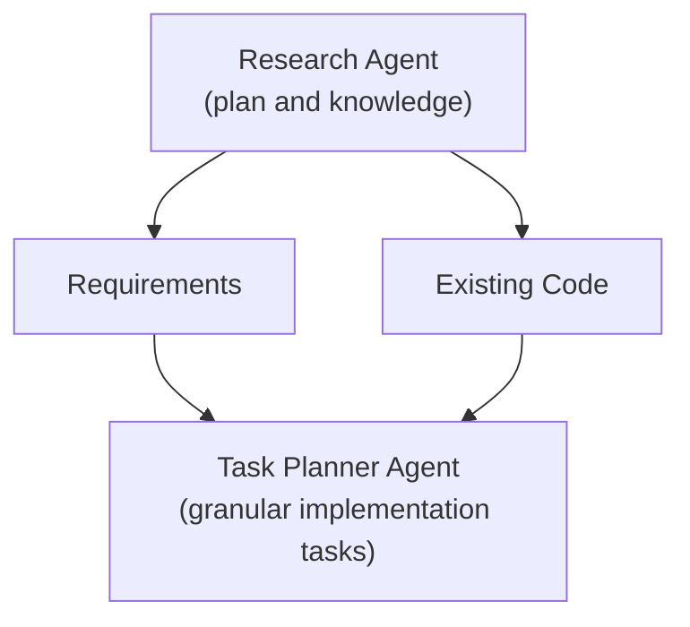

# Formation and Collision Mechanics Implementation Plan

> **Archived: reference only.** This document is deprecated. Do not execute it, and do not treat its steps, versions, or tooling references as current. The live contract is `CLAUDE.md` plus the skills in `.claude/skills/`. The shipped rule lives in `docs/decisions/2026-07-27-collision-policy.md`, amended by [2026-07-27-collision-priority-fairness-design.md](2026-07-27-collision-priority-fairness-design.md). The interactive collision-readability smoke row stays `PENDING` in `docs/development/testing.md`.

> **For Claude:** REQUIRED SUB-SKILL: Use executing-plans to implement this plan task-by-task.

**Goal:** Add deterministic, bounded-cost agent collision mechanics that create emergent frontage and crowding while preserving Hukbo's fixed-point, same-seed simulation contract.

**Architecture:** Treat body size and collision policy as validated authoritative scenario rules, but keep the rebuilt uniform grid and reusable pair/proposal buffers derived. Gather preferred movement from the tick-start state, resolve contacts in a dedicated deterministic stage with stable pair ordering, commit once, and only then evaluate attacks.

**Tech Stack:** C#/.NET, Q22.10-style integer coordinates, xUnit, FNV-1a state hashing, headless simulation tests, `Stopwatch`/GC allocation measurements.

---

## Provenance and planning boundary

This plan combines the evidence and engineering recommendations in
`docs/research/FORMATION_AND_COLLISION_MECHANICS.md` with current-source
inspection of `Scenario`, `AgentState`, `BattleSimulation`, `StateHasher`,
`FixedPoint`, the core tests, and cosmetic pawn rendering. Historical
research supports constrained frontage, local cooperation, irregular spacing,
and crowded contact; it does not justify named formations, exact ranks, or a
specific collision solver. Collision policy is therefore an explicit game
rule, not a historical claim.



Current critical facts:

- A chosen body diameter may exceed the default `AttackRangeRaw`; combat reach
  must therefore be defined before radius is accepted.
- `BattleSimulation.Create` permits overlapping random spawns and can be asked
  to place an impossible density.
- Movement proposals use tick-start positions, but current commits are
  ascending-ID ordered; a sequential resolver can turn ID into priority.
- The current center clamp is inclusive `[0, mapMaximum]`, not
  `[radius, mapMaximum-radius]`.
- `PawnRenderer` size is cosmetic and must not define authoritative radius.
- Adding scenario collision fields and changed positions will intentionally
  change baseline state hashes.

## Scope guardrails

Implement the smallest selected collision model. Do not add a rigid-body
dependency, named/slot-based formations, pathfinding, terrain avoidance,
morale, or cohesion. Do not add velocity, mass, acceleration, ORCA, or
loadout-specific radii. Do not add unsupported collision-policy enum values or
geometry that the selected resolver does not use. Modify `BattleEvent`,
`AgentView`, or `Hukbo.Client` only for the bounded spectator explanation
approved in Task 1. The current `BattleSnapshot` remains a completed-tick
render snapshot; immutable collision configuration stays reachable through
`BattleSimulation.Scenario` and the state hash. Derived grids and buffers are
neither hashed nor persisted.

### Task 1: Record and approve the collision contract (blocking)

**Files:**
- Create: `docs/decisions/2026-07-27-collision-policy.md`
- Reference: `docs/research/FORMATION_AND_COLLISION_MECHANICS.md`

**Step 1: Write the decision record**

Record one approved value for every item below, including numeric raw-unit
values and examples:

1. policy: `Soft`, `Solid`, or `FactionDependent`;
2. one common `BodyRadiusRaw`, and whether tangent contact is legal;
3. attack range: center-to-center or surface gap;
4. spawn: reject impossible density, deterministic relocation, or initial
   resolution;
5. boundary: centers in `[radius,max-radius]` or bodies allowed beyond edges;
6. movement/correction budget and whether collision can add displacement;
7. corpse interaction;
8. observability: a bounded spectator-visible reason through an authoritative
   event or selected-agent inspector field; internal counters alone are not
   sufficient unless the product owner records an explicit exception;
9. for soft/faction-dependent contact, the exact maximum penetration per
   interaction class and fixed iteration count;
10. crossing/swapping, exact co-location fallback, stable-ID priority/fairness,
    and named 200-agent acceptance plus 500-agent reporting budgets.

Include the interaction matrix for ally, enemy, corpse, and boundary contacts.
If `BodyRadiusRaw * 2 > AttackRangeRaw` under center-range semantics, reject
that combination or explicitly raise the attack range. Mark the decision
`Proposed` until the product owner approves it.

**Step 2: Review the gate**

Expected: all fields are concrete; no field says “TBD”; policy is explicitly a
game-design invention. **No implementation task (Task 2 onward) may begin
until this record is approved.** After approval, remove any planned geometry
or infrastructure that the selected resolver does not need.

**Step 3: Commit**

```text
git add docs/decisions/2026-07-27-collision-policy.md
git commit -m "docs(simulation): record collision policy"
```

### Task 2: Add the selected collision rules, validation, and hash coverage

**Files:**
- Create: `src/Hukbo.Core/Simulation/CollisionRules.cs`
- Modify: `src/Hukbo.Core/Simulation/Scenario.cs`
- Modify: `src/Hukbo.Core/Simulation/BattleSimulation.cs`
- Modify: `src/Hukbo.Core/Determinism/StateHasher.cs`
- Test: `tests/Hukbo.Core.Tests/ScenarioTests.cs`
- Test: `tests/Hukbo.Core.Tests/DeterminismTests.cs`

**Step 1: Write failing tests**

Test positive radius, selected-policy parameters, map-diameter fit,
attack/radius compatibility from Task 1, and hash changes for every
authoritative rule. Assert
`BattleSimulation` reads the common radius from its immutable `Scenario`
rather than duplicating it in every agent.

**Step 2: Verify RED**

Run:
`dotnet test tests/Hukbo.Core.Tests/Hukbo.Core.Tests.csproj --filter "FullyQualifiedName~ScenarioTests|FullyQualifiedName~DeterminismTests"`

Expected: FAIL because `CollisionRules`, validation, and hash inputs do not
exist.

**Step 3: Implement and verify GREEN**

Add only the selected resolver's configuration, checked validation,
scenario-wide radius, and FNV-1a inputs. Do not advertise unsupported runtime
policies. Do not add radius to `AgentState` or expose it through `AgentView`
unless Task 1 changes the body model from one common radius.

Run the same command. Expected: PASS. Test hash sensitivity here, but do not
re-record the canonical seed-1 state/event oracle until final integration.

**Step 4: Commit**

```text
git add src/Hukbo.Core/Simulation/CollisionRules.cs src/Hukbo.Core/Simulation/Scenario.cs src/Hukbo.Core/Simulation/BattleSimulation.cs src/Hukbo.Core/Determinism/StateHasher.cs tests/Hukbo.Core.Tests/ScenarioTests.cs tests/Hukbo.Core.Tests/DeterminismTests.cs
git commit -m "feat(simulation): add authoritative collision configuration"
```

### Task 3: Implement only the selected resolver's collision geometry

**Files:**
- Create: `src/Hukbo.Core/Simulation/CollisionGeometry.cs`
- Create: `tests/Hukbo.Core.Tests/CollisionGeometryTests.cs`

**Step 1: Write failing tests**

Cover separated, tangent, and one-raw-unit penetrating discs; stationary
agents; and checked maximum validated coordinates. If Task 1 forbids tunneling
or swapping, also cover head-on crossing, endpoint touch, and parallel miss
with swept-disc tests. A tangent is collision or clearance exactly as Task 1
decided.

**Step 2: Verify RED**

Run:
`dotnet test tests/Hukbo.Core.Tests/Hukbo.Core.Tests.csproj --filter FullyQualifiedName~CollisionGeometryTests`

Expected: FAIL because `CollisionGeometry` is missing.

**Step 3: Implement and verify GREEN**

Implement only the selected policy's integer geometry. Checked `long` is
sufficient for the validated squared-distance bounds, but second-order swept
products or discriminants must use an overflow-safe `Int128` formulation or a
documented, proven bounded reduction. Maximum-coordinate and
maximum-relative-speed tests must return the correct classification rather
than merely throw. No floating point, `Vector2`, renderer geometry, or
external physics. Run the same command. Expected: PASS.

**Step 4: Commit**

```text
git add src/Hukbo.Core/Simulation/CollisionGeometry.cs tests/Hukbo.Core.Tests/CollisionGeometryTests.cs
git commit -m "feat(simulation): add deterministic collision geometry"
```

### Task 4: Build the naive reference pair oracle

**Files:**
- Create: `src/Hukbo.Core/Simulation/CollisionPair.cs`
- Create: `tests/Hukbo.Core.Tests/NaiveCollisionPairs.cs`
- Create: `tests/Hukbo.Core.Tests/CollisionPairTests.cs`

**Step 1: Write failing tests**

For hand-built and generated small worlds, require each unordered candidate
once as `(min EntityId, max EntityId)`, sorted by that key. Cover coincident
agents, different input permutations, living/dead filtering from Task 1, and
no dependence on collection iteration order.

**Step 2: Verify RED**

Run:
`dotnet test tests/Hukbo.Core.Tests/Hukbo.Core.Tests.csproj --filter FullyQualifiedName~CollisionPairTests`

Expected: FAIL because the reference enumerator is missing.

**Step 3: Implement and verify GREEN**

Use an intentionally simple O(n²) enumerator as the correctness oracle, not
the production hot path. Run the same command. Expected: PASS.

**Step 4: Commit**

```text
git add src/Hukbo.Core/Simulation/CollisionPair.cs tests/Hukbo.Core.Tests/NaiveCollisionPairs.cs tests/Hukbo.Core.Tests/CollisionPairTests.cs
git commit -m "test(simulation): add collision pair reference oracle"
```

### Task 5: Add a rebuilt deterministic uniform grid

**Files:**
- Create: `src/Hukbo.Core/Simulation/CollisionUniformGrid.cs`
- Create: `tests/Hukbo.Core.Tests/CollisionUniformGridTests.cs`

**Step 1: Write failing equivalence tests**

Generate bounded small worlds across fixed seeds, edge cells, negative-free
origin, maximum boundary, coincident points, and crowded single cells. Compare
the sorted grid result exactly with `NaiveCollisionPairs`; also compare results
across agent-array permutations.

**Step 2: Verify RED**

Run:
`dotnet test tests/Hukbo.Core.Tests/Hukbo.Core.Tests.csproj --filter FullyQualifiedName~CollisionUniformGridTests`

Expected: FAIL because the grid is missing.

**Step 3: Implement and verify GREEN**

Rebuild each tick from authoritative positions. Use a cell size derived from
the common diameter/sweep reach, enumerate cells and neighbor offsets in fixed
order, emit each pair once, then sort by entity IDs. Dictionaries may locate
cells but their enumeration order must never decide output. Run the same
command. Expected: PASS with exact naive/grid equivalence.

**Step 4: Commit**

```text
git add src/Hukbo.Core/Simulation/CollisionUniformGrid.cs tests/Hukbo.Core.Tests/CollisionUniformGridTests.cs
git commit -m "feat(simulation): add deterministic collision grid"
```

### Task 6: Add reusable proposal, grid, and resolution scratch storage

**Files:**
- Create: `src/Hukbo.Core/Simulation/CollisionScratch.cs`
- Modify: `src/Hukbo.Core/Simulation/BattleSimulation.cs`
- Test: `tests/Hukbo.Core.Tests/BattleSimulationTests.cs`

**Step 1: Write the failing allocation test**

Warm a collision-heavy scenario, then measure 1,000 quiet and contact ticks
with `GC.GetAllocatedBytesForCurrentThread`. Assert the approved per-tick
budget and that buffers grow only when capacity is insufficient.

**Step 2: Verify RED**

Run:
`dotnet test tests/Hukbo.Core.Tests/Hukbo.Core.Tests.csproj --filter "FullyQualifiedName~RepeatedCollisionTicksHaveBoundedAllocations"`

Expected: FAIL because collision scratch storage is absent.

**Step 3: Implement and verify GREEN**

Preallocate/reuse preferred positions, resolved positions, cell entries,
pairs, occupancy counts, and bounded diagnostics. Clear logical counts, not
whole capacity unnecessarily. Expected: PASS without storing derived buffers
in snapshots or hashes.

**Step 4: Commit**

```text
git add src/Hukbo.Core/Simulation/CollisionScratch.cs src/Hukbo.Core/Simulation/BattleSimulation.cs tests/Hukbo.Core.Tests/BattleSimulationTests.cs
git commit -m "perf(simulation): reuse collision scratch buffers"
```

### Task 7: Implement only the selected resolver

**Files:**
- Create: `src/Hukbo.Core/Simulation/CollisionResolver.cs`
- Create: `tests/Hukbo.Core.Tests/CollisionResolverTests.cs`

**Step 1: Write policy-specific failing tests**

Use the approved Task 1 matrix. All policies test tangent, one-raw
penetration, head-on, crossing/swap, stationary blocker, converging agents,
coincident centers, multiple blockers, corner contact, ID order, and movement
budget. Soft/faction-dependent tests additionally assert the exact permitted
penetration and fixed iteration count; solid tests assert zero post-tick
overlap and deterministic rejection/slide/truncation candidate order.

**Step 2: Verify RED**

Run:
`dotnet test tests/Hukbo.Core.Tests/Hukbo.Core.Tests.csproj --filter FullyQualifiedName~CollisionResolverTests`

Expected: FAIL because no selected resolver exists.

**Step 3: Implement and verify GREEN**

Implement **only the approved policy** in `CollisionResolver`. Do not silently
default to soft, solid, or faction-dependent behavior and do not build
alternate production solvers. Use sorted pairs, fixed passes/candidate order,
checked integer math, explicit odd-remainder ownership, and the approved
ID-stable coincident fallback. Clamp bodies according to the approved boundary
rule. Run the same command. Expected: PASS.

**Step 4: Commit**

```text
git add src/Hukbo.Core/Simulation/CollisionResolver.cs tests/Hukbo.Core.Tests/CollisionResolverTests.cs
git commit -m "feat(simulation): resolve deterministic agent collisions"
```

### Task 8: Integrate collision between intent and attacks

**Files:**
- Modify: `src/Hukbo.Core/Simulation/BattleSimulation.cs`
- Test: `tests/Hukbo.Core.Tests/BattleSimulationTests.cs`
- Conditional: `src/Hukbo.Core/Simulation/BattleEvent.cs`
- Conditional: `tests/Hukbo.Core.Tests/BattleEventTests.cs`
- Conditional: `src/Hukbo.Core/Simulation/AgentView.cs`
- Conditional: `src/Hukbo.Client/UI/AgentInspectorPanel.cs`
- Conditional: `tests/Hukbo.Client.Tests/AgentInspectorContentTests.cs`

**Step 1: Write failing integration tests**

Assert proposals are gathered from tick-start state, grid/resolver run before
one position commit, and attacks use resolved positions. Test exact approved
attack eligibility, body surface versus center semantics, blocked attackers,
dead-body behavior, spawn policy, corners, and Move event displacement.
Test the bounded spectator explanation selected in Task 1. Change
`BattleEvent` only if authoritative collision reasons were approved; prefer a
per-agent resolved-movement reason in `AgentView` and the inspector when that
avoids per-contact event spam. If the product owner approved an observability
exception, record and test only bounded diagnostics.

**Step 2: Verify RED**

Run:
`dotnet test tests/Hukbo.Core.Tests/Hukbo.Core.Tests.csproj --filter "FullyQualifiedName~BattleSimulationTests|FullyQualifiedName~BattleEventTests"`

Expected: FAIL because unrestricted movement/crossing still occurs.

**Step 3: Implement and verify GREEN**

Split current `GatherAndCommitMovement` into gather, resolve, and single commit
stages. Centralize approved attack-distance calculation so intent selection
and attack gathering cannot disagree. Apply the approved deterministic spawn
policy; if that policy rejects impossible density, fail clearly. Run the same
command. Expected: PASS.

**Step 4: Verify the spectator explanation**

If Task 1 selected inspector exposure, run:
`dotnet test tests/Hukbo.Client.Tests/Hukbo.Client.Tests.csproj --filter FullyQualifiedName~AgentInspectorContentTests`

Expected: PASS with a stable blocked/slid/separated/corrected label and no
presentation-to-Core feedback. If Task 1 selected events, run the focused
`BattleEventTests` instead.

**Step 5: Commit**

```text
git add src/Hukbo.Core/Simulation/BattleSimulation.cs tests/Hukbo.Core.Tests/BattleSimulationTests.cs
git commit -m "feat(simulation): integrate collision into battle ticks"
```

Add only the approved `BattleEvent` or `AgentView`/inspector files and their
tests to that commit.

### Task 9: Lock regression, permutation, and determinism behavior

**Files:**
- Modify: `tests/Hukbo.Core.Tests/BattleSimulationTests.cs`
- Modify: `tests/Hukbo.Core.Tests/DeterminismTests.cs`
- Create: `tests/Hukbo.Core.Tests/CollisionRegressionTests.cs`

**Step 1: Write the regression matrix**

Turn every acceptance row below into a named test. Add repeated independent
runs comparing ordered events and every-tick hashes, input-array permutation
tests, ID-renumbering tests that expose approved priority semantics, and
generated grid/reference equivalence. Record the first mismatch tick/seed in
assertion messages.

**Step 2: Verify and correct**

Run:
`dotnet test tests/Hukbo.Core.Tests/Hukbo.Core.Tests.csproj --filter "FullyQualifiedName~Collision|FullyQualifiedName~DeterminismTests"`

Expected before gaps are fixed: FAIL on uncovered contract behavior. Correct
only the resolver/integration cause; expected final result: PASS on three
consecutive runs.

**Step 3: Commit**

```text
git add tests/Hukbo.Core.Tests/BattleSimulationTests.cs tests/Hukbo.Core.Tests/DeterminismTests.cs tests/Hukbo.Core.Tests/CollisionRegressionTests.cs
git commit -m "test(simulation): lock collision determinism regressions"
```

### Task 10: Document the oracle and verify 200/500 performance

**Files:**
- Modify: `src/Hukbo.Headless/RunReport.cs`
- Modify: `src/Hukbo.Headless/HeadlessRunner.cs`
- Modify: `tests/Hukbo.Core.Tests/HeadlessRunnerTests.cs`
- Modify: `SIMULATION-GAME-STANDARDS.md`
- Modify: `docs/development/testing.md`
- Modify: `.claude/skills/hukbo-determinism-change/SKILL.md`

**Step 1: Add deterministic metric-reporting checks**

Extend the existing headless `RunReport` with explicitly defined aggregate
collision metrics from Task 6: candidate/contact pairs, accepted movement,
maximum/p95 penetration, blocked streaks, front width/depth, and agents able to
attack. Add small deterministic `HeadlessRunnerTests` for metric units,
aggregation, serialization, and repeated-run equality. Keep workstation timing
budgets out of the normal xUnit suite.

Add a named packed-front Core integration test that proves opponents enter the
approved attack geometry and damage occurs.

Run:
`dotnet test tests/Hukbo.Core.Tests/Hukbo.Core.Tests.csproj -c Release --filter "FullyQualifiedName~HeadlessRunnerTests|FullyQualifiedName~PackedFront"`

Expected initially: FAIL for missing report fields or packed-front behavior.
Implement the smallest reporting path; expected finally: PASS without adding
the long 200/500 workloads to ordinary test discovery.

**Step 2: Verify tactical regression guards**

Run:
`dotnet test tests/Hukbo.Core.Tests/Hukbo.Core.Tests.csproj -c Release --filter "FullyQualifiedName~PackedFront|FullyQualifiedName~SeedsOneThroughTwentyProduceVictoriesForBothFactions"`

Expected: PASS; the packed front produces damage and seeds 1-20 still produce
victories for both factions rather than universal draws.

**Step 3: Commit reporting and tactical guards**

```text
git add src/Hukbo.Headless/RunReport.cs src/Hukbo.Headless/HeadlessRunner.cs tests/Hukbo.Core.Tests/HeadlessRunnerTests.cs tests/Hukbo.Core.Tests/BattleSimulationTests.cs
git commit -m "feat(headless): report collision metrics"
```

**Step 4: Run the canonical and stress gates**

Run:
`./scripts/verify.ps1`

Expected: PASS for prerequisite, formatting, Release build/tests, and the
seed-1 200-agent deterministic workload; the battle terminates within its
approved tick limit.

Run:
`./scripts/benchmark.ps1 -Agents 200 -Ticks 10000 -Seed 1 -Output artifacts/benchmarks/collision-200.json`

Expected: two same-build simulations match at every tick and report the new
state/event oracle, timing/allocation data, and collision metrics. The approved
200-agent budget is evaluated on the named workstation here.

Run:
`./scripts/benchmark.ps1 -Agents 500 -Ticks 10000 -Seed 1 -Output artifacts/benchmarks/collision-500.json`

Expected: deterministic completion or the explicitly approved 500-agent
reporting outcome, with collision metrics attached.

**Step 5: Verify spectator readability**

Run `./scripts/run.ps1` on an interactive Windows desktop. Observe one
collision-heavy engagement and record whether the front is readable, agents do
not visually stack or jitter beyond the approved policy, combat continues, and
the inspector/event mechanism explains blocked, slid, separated, or corrected
movement. Automated tests do not substitute for this smoke check.

**Step 6: Update the contract and oracle once**

Document the chosen policy as a game rule, tick stage, interaction matrix,
numeric/ordering rules, derived-grid oracle, final state/event hashes,
outcome/tick, allocation, hardware, 200/500 measurements, seed-distribution
result, and interactive smoke status. Update both `docs/development/testing.md`
and `.claude/skills/hukbo-determinism-change/SKILL.md` from the same final
verified run. Preserve the historical warning against named formations.

**Step 7: Commit documentation**

```text
git add SIMULATION-GAME-STANDARDS.md docs/development/testing.md .claude/skills/hukbo-determinism-change/SKILL.md
git commit -m "docs(simulation): record collision contract and performance"
```

## Acceptance matrix

| Case | Required assertion |
| --- | --- |
| Tangent | Classified exactly per Task 1; no rounding drift |
| 1-raw penetration | Detected and reduced to the approved bound |
| Head-on | No unapproved overlap, tunneling, or swap |
| Crossing | Swept paths follow the selected crossing rule |
| Stationary | Mover respects a nonmoving blocker |
| Converging | Simultaneous proposals resolve by documented total order |
| Coincident | ID-stable fallback terminates without overflow/jitter ambiguity |
| Multiple blockers | Fixed pair/candidate order; budget respected |
| Corner | Body/boundary rule holds on both axes |
| ID order | Priority/fairness matches the decision record |
| Attack eligibility | Intent and attack use the same approved reach formula |
| Packed front | Opponents enter approved attack geometry and damage occurs |
| Battle completion | Canonical 200-agent battle terminates within its approved limit |
| Seed distribution | Seeds 1-20 still produce victories for both factions |
| Dead behavior | Corpse interaction and dead non-action match the matrix |
| Permutation | Input storage order cannot change ordered results |
| Grid equivalence | Sorted uniform-grid pairs equal naive pairs |
| Determinism | Same seed yields identical events and per-tick hashes |
| Allocations | Warm collision ticks stay within the approved budget |
| Performance | 200-agent gate passes; 500-agent result is reported |
| Spectator clarity | Inspector/event explains blocking, sliding, or correction |

## Final verification and review

Run `git diff --check`, inspect `git diff --stat` and the complete diff, and
confirm `./scripts/verify.ps1` plus explicit 200/500 benchmarks have recorded
results. Every changed line must belong to the approved contract,
implementation, tests, or documentation. Request an independent review
focused on checked arithmetic, exact-co-location fallback, ID fairness, pair
completeness, spawn impossibility, attack reach, anti-stall behavior, spectator
explanation, hot-loop allocation, and accidental scope. Resolve all Critical
and High findings before calling the feature complete.
