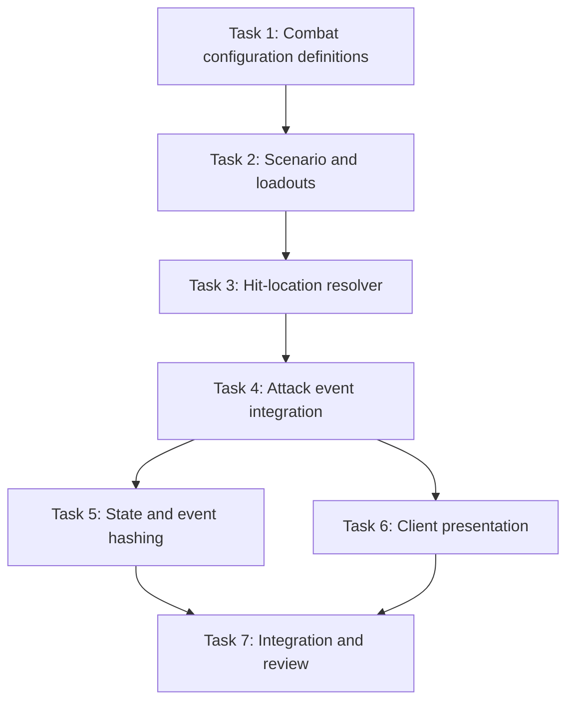

# Philippine Combat Configuration Orchestration Plan

## Purpose

Coordinate the future implementation of
`2026-07-26-philippine-combat-configuration.md` while preserving deterministic
behavior, non-overlapping ownership, and a reviewable diff.

This file is an execution map, not authorization to implement. The current
request ends after planning artifacts are prepared.

## Planning pipeline

```text
Research Agent
  -> current architecture, source evidence, constraints, unknowns

Task Planner Agent
  -> ordered tasks, dependencies, tests, file ownership

Plan Reviewer Finalizer
  -> scope audit, determinism audit, historical-boundary audit,
     verification audit, final artifact corrections
```

The Orchestrator owns final decisions and resolves conflicts between worker
recommendations.

## Approved objective

Deliver one end-to-end Philippine combat configuration vertical slice:

- authoritative mixed loadouts;
- deterministic weighted hit locations;
- armor/shield target bias;
- explanatory attack events and hashes; and
- spectator presentation aligned with authoritative simulation state.

Terrain and naval mechanics remain explicitly deferred.

## Preconditions

Before implementation:

1. Record the starting branch and commit.
2. Confirm the in-progress Hukbo rename and tactical-hit-effect changes are
   committed or otherwise isolated.
3. Create an isolated `codex/philippine-combat-config` worktree/branch.
4. Run `.\scripts\verify.ps1 -SkipBootstrap` and record baseline failures.
5. Confirm the three planning files are present in that baseline.
6. Do not refresh the code graph unless explicitly authorized; verify graph
   findings against current `Hukbo.*` source.

If the baseline verification fails, classify and record it before feature work.
Do not modify combat code to compensate for an environmental or unrelated
failure.

## Dependency graph



Tasks 1–4 are sequential because they share Core contracts. Tasks 5 and 6 may
run concurrently after Task 4 because they own separate subsystems. Task 7
starts only after both are integrated.

## Agent assignments

### Orchestrator

**Objective:** Own decomposition, integration, failure classification, final
diff, and completion report.

**Owned files:** Planning files and integration decisions only.

**Success condition:** Every explicit requirement is covered, ownership does
not overlap, Critical/High findings are resolved, and final verification passes.

**Prohibited scope:** Do not perform opportunistic refactors or silently absorb
unrelated working-tree changes.

### Worker A: Combat configuration owner

**Objective:** Execute Tasks 1 and 2.

**Owned files:**

- `src/Hukbo.Core/Combat/**`
- `src/Hukbo.Core/Simulation/Scenario.cs`
- `src/Hukbo.Core/Simulation/AgentState.cs`
- `src/Hukbo.Core/Simulation/AgentView.cs`
- configuration/assignment sections of
  `src/Hukbo.Core/Simulation/BattleSimulation.cs`
- `tests/Hukbo.Core.Tests/CombatConfigurationTests.cs`
- scenario/assignment sections of existing Core tests.

**Expected output:** Validated immutable preset and deterministic authoritative
loadouts.

**Success condition:** Tasks 1–2 focused tests pass.

**Dependencies:** Baseline verification.

**Prohibited scope:** No hit-location sampling, event changes, hashes, Client,
terrain, naval, or physiology.

### Worker B: Combat resolution owner

**Objective:** Execute Tasks 3 and 4 after Worker A is integrated.

**Owned files:**

- `src/Hukbo.Core/Combat/HitLocationResolver.cs`
- attack-resolution sections of
  `src/Hukbo.Core/Simulation/BattleSimulation.cs`
- `src/Hukbo.Core/Simulation/BattleEvent.cs`
- `tests/Hukbo.Core.Tests/HitLocationResolverTests.cs`
- attack/event sections of Core tests.

**Expected output:** Stateless weighted selection and authoritative attack
context without changing aggregate damage semantics.

**Success condition:** Tasks 3–4 focused tests pass, including simultaneous
death regression.

**Dependencies:** Worker A.

**Prohibited scope:** No hashes, presentation, damage multipliers, wounds, or
directional shield logic.

### Worker C: Determinism and Headless owner

**Objective:** Execute Task 5.

**Owned files:**

- `src/Hukbo.Core/Determinism/StateHasher.cs`
- `src/Hukbo.Headless/HeadlessRunner.cs`
- determinism/headless test sections.

**Expected output:** Complete state and event hash coverage with stable null
sentinels and golden vectors.

**Success condition:** Determinism and Headless tests pass twice from a clean
process.

**Dependencies:** Worker B.

**Prohibited scope:** No simulation behavior or Client changes.

### Worker D: Spectator presentation owner

**Objective:** Execute Task 6.

**Owned files:**

- `src/Hukbo.Client/Presentation/PawnAppearance.cs`
- `src/Hukbo.Client/Presentation/PawnAppearanceFactory.cs`
- `src/Hukbo.Client/Rendering/PawnGeometry.cs`
- `src/Hukbo.Client/Rendering/PawnRenderer.cs`
- `src/Hukbo.Client/UI/AgentInspectorPanel.cs`
- `src/Hukbo.Client/UI/BattleEventLogPanel.cs`
- task-scoped call sites in `src/Hukbo.Client/ArenaGame.cs`
- corresponding Client tests.

**Expected output:** Authoritative weapon silhouettes and explanatory UI.

**Success condition:** Client tests pass and no factory derives weapons from
entity ID.

**Dependencies:** Worker B's public Core/event contract.

**Prohibited scope:** No Core behavior, assets, hit-effect redesign, or UI
configuration screen.

### Worker E: Integration test owner

**Objective:** Add Task 7 end-to-end coverage after Workers C and D integrate.

**Owned files:**

- `tests/Hukbo.Core.Tests/PhilippineCombatIntegrationTests.cs`

**Expected output:** Deterministic full-boundary and distribution tests.

**Success condition:** Focused integration test passes without production-code
changes.

**Dependencies:** Workers C and D.

**Prohibited scope:** Do not fix production code. Report failures to the
Orchestrator for classification and reassignment.

### Independent reviewer

**Objective:** Review the complete diff read-only.

**Owned files:** None.

**Expected output:** Findings classified Critical, High, Medium, or Low with
exact file/line evidence.

**Success condition:** Confirms requirements, determinism, validation, hashing,
historical labeling, test quality, performance risk, and scope discipline.

**Dependencies:** Worker E and repository verification.

**Prohibited scope:** No edits and no expansion for unrelated Medium/Low issues.

## Execution protocol

For every task:

1. Orchestrator assigns exact ownership and records the starting commit.
2. Worker writes the failing test.
3. Worker runs the narrowest test and records the expected failure.
4. Worker implements only the minimum behavior.
5. Worker reruns the focused test.
6. Worker inspects its scoped diff and commits with Conventional Commits.
7. Orchestrator reviews and integrates before unlocking dependents.

Each file has one writable owner at a time. If a later task needs a file owned
by an earlier task, ownership transfers only after the earlier commit is
integrated.

## Checkpoints

### Checkpoint 1: Configuration boundary

After Task 2:

- preset validation passes;
- loadouts are authoritative and visible in `AgentView`;
- existing movement and damage tests remain green; and
- no attack behavior has changed yet.

### Checkpoint 2: Authoritative combat boundary

After Task 5:

- every attack resolves a valid configured body part;
- aggregate damage semantics are unchanged;
- state and event hashes cover all new fields; and
- same-seed Core/Headless runs match.

### Checkpoint 3: End-to-end boundary

After Task 7:

- Client visuals match authoritative weapons;
- inspector and event log explain weapon/location;
- shield and weapon distribution tests pass;
- full verification passes; and
- independent review has no unresolved Critical/High findings.

## Failure handling

Classify each failure as:

- implementation defect;
- test defect;
- environment/dependency failure;
- pre-existing repository failure;
- incorrect assumption;
- unrelated failure; or
- flaky/nondeterministic behavior.

Use at most three implementation–verification cycles for one failure mode. On
the third repeated failure, stop, preserve evidence, and choose a materially
different approach or report the blocker.

Never weaken determinism, hashing, or simultaneous-damage tests to make a check
pass.

## Integration commands

```powershell
dotnet test tests/Hukbo.Core.Tests/Hukbo.Core.Tests.csproj -c Release
dotnet test tests/Hukbo.Client.Tests/Hukbo.Client.Tests.csproj -c Release
dotnet build Hukbo.slnx -c Release --no-restore
.\scripts\format.ps1 -Verify
.\scripts\verify.ps1 -SkipBootstrap
git diff --check
git status --short
```

Run targeted tests first, then these broader checks.

## Final completion report

Use:

```text
Implemented:
- Configuration, simulation, hashing, and presentation outcomes.

Verification:
- Focused commands and results.
- Repository-level commands and results.

Key decisions:
- Hit location is authoritative metadata, not physiology.
- Weapon overrides inherit unlisted general weights.
- Shield bias uses provisional basis-point multipliers.
- Terrain/naval behavior remains deferred.

Files changed:
- Core configuration.
- Simulation and determinism.
- Headless.
- Client presentation.
- Tests.

Unresolved:
- Pre-existing failures, environmental blockers, or deferred work.
```

Do not claim completion if required verification did not run or did not pass.
