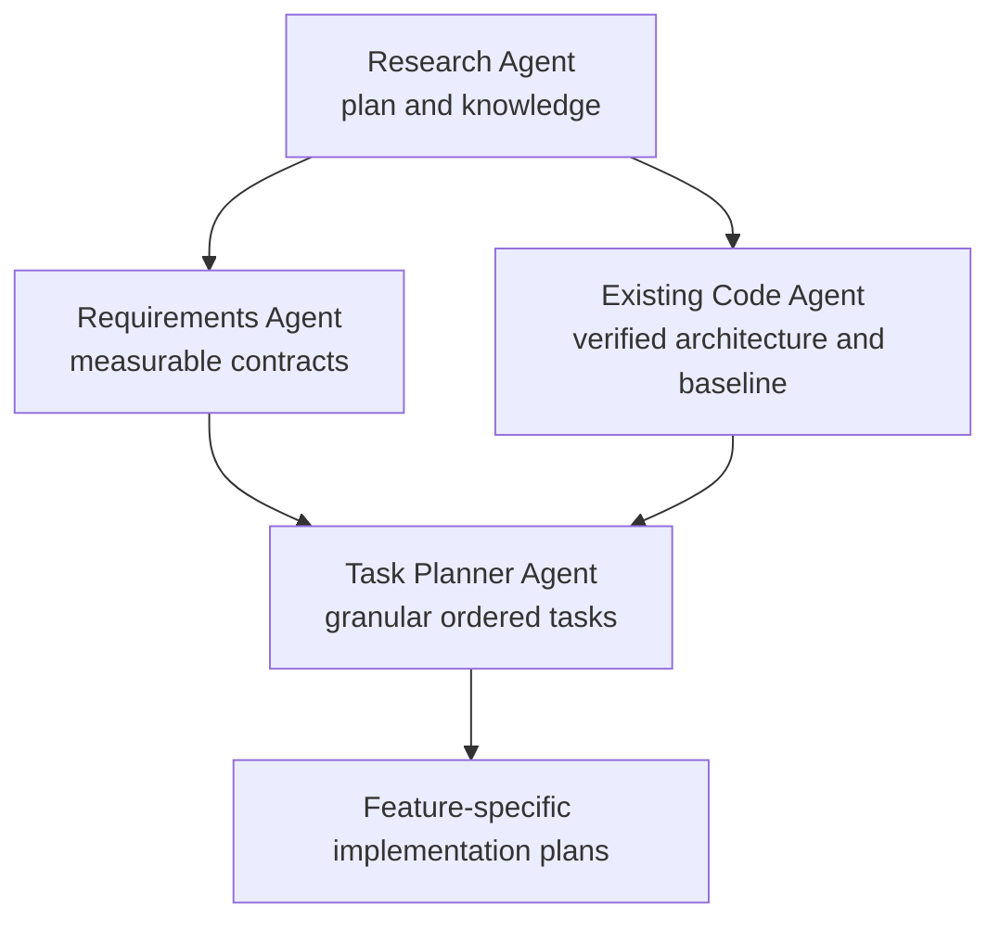

# Large-Scale Simulation Architecture Planning Design

## Goal

Convert the large-scale simulation research into measurable Hukbo
requirements, a verified current-code model, and an ordered backlog of
implementation plans without prematurely authorizing a broad engine rewrite.

## Audience and intended use

The primary readers are the Research Agent, Requirements Agent, Existing Code
Agent, Task Planner Agent, implementation agents, and reviewers working on
Hukbo.

This document defines how knowledge moves between those roles. The companion
implementation plan defines the tasks and verification gates. Neither document
authorizes code execution by itself.

## Planning pipeline



The Research Agent provides one shared evidence packet to both analysis
branches. Requirements and Existing Code work independently so desired behavior
does not become a disguised description of current implementation and current
implementation does not silently limit product requirements. The Task Planner
Agent reconciles both branches.

## Locked planning scope

The pipeline covers:

- simulation stage instrumentation;
- deterministic spatial perception;
- tick-event storage;
- unit-definition scaling;
- formation-level decision architecture;
- global navigation and local steering boundaries;
- presentation and authoritative update rates;
- deterministic proposal parallelism; and
- benchmark, correctness, and compatibility gates.

It does not authorize:

- a general-purpose ECS;
- campaign, economy, diplomacy, or persistence work;
- multiplayer;
- a replacement engine or runtime;
- camera-dependent authoritative LOD;
- final balance values;
- speculative unit abilities; or
- simultaneous implementation of all research recommendations.

## Shared definitions

- **Combatant:** one individually simulated warrior.
- **Unit definition:** immutable content describing one combatant archetype.
- **Formation:** an authoritative group receiving shared tactical orders.
- **Detachment:** one or more formations assigned to an objective.
- **Derived cache:** rebuildable data such as a spatial grid or cached path.
- **Proposal:** a potential state change gathered from tick-start state.
- **Commit:** the stable ordered application of accepted proposals.
- **Authoritative LOD:** a deterministic difference in simulation cadence or
  detail that can affect outcomes.
- **Presentation LOD:** a visual-only difference that cannot affect outcomes.

## Agent contracts

### Research Agent

**Objective:** Maintain the evidence packet and identify which external
practices are confirmed, inferred, or unsuitable for Hukbo.

**Inputs:**

- `docs/research/LARGE-SCALE-SIMULATION-ARCHITECTURE.md`
- `docs/research/FORMATION_AND_COLLISION_MECHANICS.md`
- Creative Assembly disclosures and GDC material
- RTS postmortems and peer-reviewed algorithms
- `SIMULATION-GAME-STANDARDS.md`

**Owned files or subsystem:**

- large-scale simulation research brief
- source ledger and evidence-quality notes
- research corrections requested by reviewers

**Expected output:**

```text
Finding:
Evidence class:
Source:
Applicability to Hukbo:
Constraint:
Open question:
```

**Success condition:** Requirements and Existing Code agents receive the same
source-backed model, and no proprietary Total War detail is invented.

**Dependencies:** Accessible primary or authoritative sources.

**Prohibited scope:** Source-code changes, numeric acceptance budgets, and
implementation sequencing.

### Requirements Agent

**Objective:** Translate research and product direction into binary,
hardware-named acceptance contracts.

**Inputs:**

- Research Agent packet
- `README.md`
- `SIMULATION-GAME-STANDARDS.md`
- `docs/development/testing.md`
- product direction and supported-platform documents

**Owned files or subsystem:**

- `docs/plans/YYYY-MM-DD-<feature>-requirements.md`

The requirements artifact is complete before Task Planner ownership begins.
The Task Planner consumes it but does not silently rewrite accepted product
requirements; proposed changes return to the Requirements Agent or user.

**Expected output:**

```text
Capability:
Required scale:
Scenario:
Correctness oracle:
Performance metric:
Acceptance threshold:
Compatibility constraint:
Out of scope:
```

**Success condition:** Every proposed optimization has a workload, metric,
oracle, and binary pass condition.

**Dependencies:** Research packet and existing product gates.

**Prohibited scope:** Assuming the current implementation is the required
architecture, choosing code structure, or replacing provisional budgets with
unsourced targets.

### Existing Code Agent

**Objective:** Produce a source-verified map of current state, costs,
determinism contracts, tests, and modification boundaries.

**Inputs:**

- Research Agent packet
- current repository knowledge graph
- current source and tests
- headless and client benchmark tools
- clean working-tree baseline

**Owned files or subsystem:** Read-only investigation; benchmark artifacts only
when an approved plan names their location.

**Expected output:**

```text
Relevant symbol:
Source path and lines:
Current behavior:
Complexity:
Allocation or timing evidence:
Tests protecting it:
Change boundary:
Risk:
```

**Success condition:** Every planner claim is verified against current source,
especially when the repository graph is stale.

**Dependencies:** Buildable current repository and named benchmark workloads.

**Prohibited scope:** Code edits, repository re-indexing without authorization,
and redesigning behavior during discovery.

### Task Planner Agent

**Objective:** Reconcile requirements with current code and create the smallest
ordered plans that close one measured gap at a time.

**Inputs:**

- Research Agent findings
- Requirements Agent contracts
- Existing Code Agent map and baseline
- current repository status

**Owned files or subsystem:**

- dated feature-specific design and implementation files under `docs/plans/`,
  excluding `*-requirements.md`
- task dependency graph
- final planning diff

**Expected output:** Bite-sized TDD tasks with exact files, commands, expected
failures, minimal implementations, verification, and commit boundaries.

**Success condition:** An implementation agent with no conversation context can
execute the plan without guessing product behavior, file ownership, or success
criteria.

**Dependencies:** Both branches must be complete. Neither branch may be
silently substituted for the other.

**Prohibited scope:** Bundling independent optimizations, authorizing a broad
rewrite, hiding unresolved assumptions, or claiming performance without
measurement.

## Information packets

### Research packet

Required fields:

- confirmed external practice;
- source and date;
- whether it concerns content scale or runtime scale;
- known trade-off;
- relevance to Hukbo;
- evidence limitation; and
- resulting question, not presumed answer.

### Requirements packet

Required fields:

- user-visible capability;
- supported scale;
- named scenario and hardware;
- correctness oracle;
- p50/p95/p99/max or allocation metric;
- threshold status: accepted, provisional, or unknown;
- compatibility and determinism requirement; and
- explicit non-goals.

### Existing-code packet

Required fields:

- live source path;
- symbol or stage;
- current data read and written;
- asymptotic cost;
- measured cost if available;
- allocation behavior;
- total-order or RNG dependency;
- relevant tests; and
- likely blast radius.

### Planner decision record

Every planned feature records:

```text
Problem:
Evidence:
Requirement:
Current gap:
Smallest complete change:
Rejected alternatives:
Verification:
Rollback or disable path:
Dependencies:
```

## Planning rules

1. Algorithmic improvements precede concurrency.
2. Every optimization preserves a reference implementation until equivalence is
   demonstrated.
3. Every derived cache has a rebuild and cold-cache equivalence test.
4. Every multirate authoritative system uses a tick-derived schedule.
5. Presentation LOD never affects authoritative state.
6. Unit-definition growth uses composition and sparse overrides, not subclasses
   or a dense matchup matrix.
7. Formation navigation and local steering remain separate.
8. Parallel workers gather from immutable state and never commit shared state.
9. Each feature receives its own design and implementation plan once its
   prerequisite gate passes.
10. A measured regression is reported, not hidden by weakening a threshold.

## Dependency order

```text
measurement baseline
    |
    +--> event-storage plan
    |
    +--> spatial-perception plan
    |
    +--> unit-definition plan

spatial-perception plan + unit-definition plan
    |
    v
formation plan
    |
    v
navigation and collision plan
    |
    v
deterministic-parallelism plan
```

Event storage, spatial perception, and unit definitions may be planned
independently after the measurement contract. Implementations with overlapping
files must still be serialized or isolated and deliberately integrated.

## Decision gates

### Measurement gate

The Task Planner may create an optimization implementation plan only after the
Requirements Agent defines the workload and the Existing Code Agent captures
the baseline.

### Architecture gate

A new subsystem such as formations or navigation requires:

- a user-visible capability;
- a declared tick stage;
- authoritative and derived-state classification;
- total ordering;
- serialization impact;
- worst-case complexity;
- tests and benchmarks; and
- an explanation surface for spectators.

### Parallelism gate

Parallel execution is deferred until:

- sequential behavior is correct;
- work is partitionable from immutable inputs;
- proposal buffers are bounded;
- stable merge keys exist; and
- measurement shows the sequential stage consumes material budget.

## Reader acceptance

A fresh reader must be able to answer:

1. Why does the pipeline split requirements from existing-code analysis?
2. What may the Research Agent claim about Total War?
3. What evidence is required before planning an optimization?
4. Which optimization comes first and why?
5. Why is a generic ECS not currently authorized?
6. How do formation navigation and local steering differ?
7. What makes authoritative LOD deterministic?
8. When may parallel execution be introduced?
9. What exact artifact does each agent produce?
10. Which document contains the execution tasks?

The design fails if these answers require conversation context.
