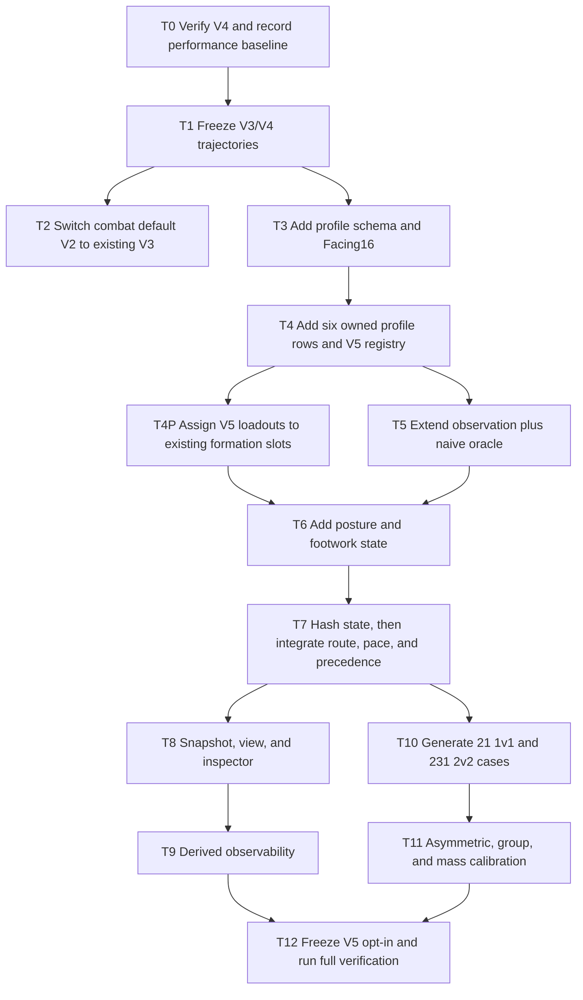

# Weapon-Relative Movement Implementation Plan

> **For Codex:** REQUIRED SUB-SKILL: Use `executing-plans` to implement this plan task-by-task.

**Goal:** Add deterministic, opt-in equipment-relative movement for Hukbo's six implemented loadouts while preserving every existing movement preset and keeping combat rules unchanged.

**Architecture:** Verify and freeze the current `PersistentContingentsV4` baseline first, then add the next movement preset, provisionally `EquipmentRelativeFootworkV5 = 5`. V5 resolves immutable profiles by complete `CombatLoadout`, derives bounded local/global count and composition context in scratch storage, writes separate `TacticalPosture`, `FootworkPhase`, lifecycle timer, integer facing, and retained scalar pace, and applies a pace-and-route abstraction before the existing collision stage. It does not add velocity, physics, directional combat, or a new default movement behavior.

**Tech Stack:** .NET 10 / C#, xUnit, Hukbo fixed-point integer math, SplitMix64 only where an existing deterministic salt is required, MonoGame client presentation, PowerShell verification scripts.

---

Research inputs:

- [`docs/research/movement/README.md`](../../research/movement/README.md)
- [`kampilan.md`](../../research/movement/kampilan.md)
- [`wasay.md`](../../research/movement/wasay.md)
- [`kalis.md`](../../research/movement/kalis.md)
- [`itak.md`](../../research/movement/itak.md)
- [`tall-hardwood-shield.md`](../../research/movement/tall-hardwood-shield.md)

This document is a plan, not implementation authorization.

## Goal, known facts, and assumptions

### Known facts

- `Scenario.MovementPreset` currently defaults to `PersistentContingentsV4`.
- V4 narrows the cross-contingent cohesion scan, is registered as
  `MovementPresetId = 4`, is the current default, and has focused registry and
  contingent tests. Its baseline must be verified before V5 takes ownership
  of adjacent code.
- Movement presets V1 through V4 are replay contracts. Their movement, events, outcomes, and state hashes must remain unchanged when selected explicitly.
- `Scenario.CombatPreset` still defaults to `PrecolonialPhilippinesV2`, although the already-registered V3 is described as the newest preset. The approved V2-to-V3 default switch is a separate task and must not modify either combat ruleset.
- V2 fields all six research loadouts. V3 fields the four solo loadouts. V5 must support both, with shield scenarios explicitly selecting V2 after the combat-default switch.
- `BattleSimulation.AdvanceOneTick()` currently orders cooldown decrement, target/intent selection, contingent-state resolution, movement proposal gathering, collision resolution, movement commit, attack commit, and outcome resolution.
- `ContingentState.Break` is a persistent cohesion condition and `AgentIntent.Regrouping` is the last-stand override. Neither means tactical disadvantage and neither may be repurposed.
- `AgentState`, `StateHasher`, `AgentView`, `BattleSnapshot`, and the inspector are the authoritative-state-to-spectator path.

### Material assumptions

- V4 remains numeric value `4`. If another movement preset lands first, the implementer must allocate the next unused numeric value and rename V5 references in this plan without renumbering any existing value.
- The initial profile values are provisional gameplay defaults from the research documents. Calibration may reject them before activation.
- Armor is part of the profile key even though all current rows use `LightOrganic`. A future armor must fail profile validation rather than silently inherit another row.
- Counts include the acting living warrior on the ally side. Dead agents count nowhere.
- Exact threshold equality takes the conservative branch: equality enters disengagement and equality leaves it only at the lower release threshold.
- Local context is derived at tick start. No warrior observes a move committed earlier in the same tick.

## Affected areas

| Area | Current symbol | Planned responsibility |
| --- | --- | --- |
| Preset identity | `MovementPresetId` | Append V5; keep V1–V4 frozen and V4 default |
| Immutable configuration | `MovementRuleset`, `MovementPresetRegistry` | Six full-loadout profiles and V5-only feature flag/content identity |
| Equipment data | new `Movement/Profiles/*.cs` | One complete immutable row per supported `CombatLoadout` |
| Initial placement | `FormationPlanner`, `BattleSimulation.Create` | V5-only deterministic assignment of high-clearance loadouts to roomier existing slots; no new formation geometry |
| Derived perception | `BattleSimulation.SelectTargetsAndIntents`, new `LocalMovementContext` | One V5-only deterministic all-agent observation pass; bounded local counts/composition and stable nearest-support/threat results |
| Authoritative state | `AgentState` | Facing, scalar retained pace, posture, footwork phase, remaining phase ticks |
| Pipeline | `BattleSimulation` | Context, posture, phase, route, pace, then existing collision |
| Hash/snapshot/view | `StateHasher`, `AgentView`, `BattleSnapshot` | V5 state identity and spectator exposure |
| Presentation | `AgentInspectorContent`, `AgentInspectorPanel` | Plain-language facing/posture/phase lines |
| Observability | `MovementBehaviorMetrics`, `RunReport`, sampled simulation logs | Derived counts only; never simulation input |
| Verification | Core/Client tests, fixtures, headless scenarios | freeze, oracle, matrix, determinism, performance, manual smoke |

## Non-goals

- No edits to damage, reach, cooldown, combos, clash, hit location, or shield interception.
- No directional attack, defense, shield arc, parry, interception, or friendly damage.
- No velocity vector, acceleration engine, rigid-body physics, terrain, or pathfinding.
- No morale, panic, rout, surrender, or campaign state.
- No rigid formation slots, shield wall, or mixed-contingent rewrite.
- No movement-speed bonus from ally count, enemy count, or global advantage.
- No `System.Random`, floating-point authoritative math, wall clock, filesystem, diagnostics dependency, unbounded cache, or snapshot of derived query data.
- No default activation of V5 in this workstream.

## Authoritative architecture

### Version and freeze strategy

Append `EquipmentRelativeFootworkV5 = 5` to `MovementPresetId`. `Scenario.MovementPreset` remains V4. The existing `--movement-preset` option is the only activation surface needed.

Add `UsesEquipmentRelativeFootwork` and an immutable ordered profile collection to `MovementRuleset`. Existing presets register the flag as `false` and an empty collection; V5 registers `true` and exactly six profiles. Adding fields will move pinned `MovementRuleset.ContentHash` literals, as existing source comments anticipate, but must not move V1–V4 behavior.

Before changing `MovementRuleset`, capture explicit V3 and V4 movement
trajectory fixtures using combat V2 and the verified baseline. Existing V1/V2
fixtures remain. Freeze tests must name both combat and movement presets
explicitly. Extending the ruleset schema causes the documented one-time update
to pinned V1–V4 `MovementRuleset.ContentHash` literals; legacy state hashes,
event hashes, outcomes, ordered events, and trajectories remain byte-identical.

V5 folds its movement content hash and new agent fields into the state hash. Legacy presets do not. Extend `StateHasher.Compute` with `ulong? movementContentHash`; when `null`, execute the byte-for-byte legacy fold. When non-null, append the movement content hash after the combat content hash and append the five new agent fields after `ContingentState`. `BattleSimulation` passes `null` for V1–V4 and V5's hash for V5. This conditional is intentional compatibility, not a fallback.

Extend `MovementRuleset.ComputeContentHash` after its current final boolean in
this exact FNV-1a order:

1. `UsesEquipmentRelativeFootwork` as `0UL` or `1UL`;
2. immediate and support radius basis points;
3. profile count;
4. for each profile in canonical `KP, WA, KA, IT, KS, IS` order: weapon,
   armor, shield enum values; every scalar property in the declaration order
   below through preferred distance; opponent-offset count and its six cells
   in canonical opponent order; then all remaining scalar properties in
   declaration order.

Fold nonnegative integers with the existing `(ulong)value` convention. Fold a
signed opponent offset as `unchecked((ulong)(long)value)`, preserving its
two's-complement value. Tests change each scalar and each offset cell
independently and require a different content hash; rebuilding the same
canonical rows in a different constructor-call order must produce the same
hash. V1–V4 intentionally receive their one-time new ruleset-content literals
while their behavior/state/event/trajectory fixtures remain unchanged.

### Exact configuration types

Create `src/Hukbo.Core/Movement/LoadoutMovementProfile.cs` as a sealed immutable class with constructor validation and these properties:

```text
CombatLoadout Loadout
int ForwardPaceBasisPoints
int LateralPaceBasisPoints
int BackwardPaceBasisPoints
int CommittedPaceBasisPoints
int PreferredDistanceBasisPoints
ImmutableArray<int> OpponentDistanceOffsetBasisPoints
int MaximumFacingStepsPerTick
int CommittedFacingStepsPerTick
int AccelerationBasisPointsPerTick
int DecelerationBasisPointsPerTick
int CommitmentTicks
int RecoveryTicks
int AllyClearanceBodyDiametersBasisPoints
int DisengageEnemyToAllyBasisPoints
int ReengageEnemyToAllyBasisPoints
int PursuitSupportBodyDiametersBasisPoints
```

Every pace is in `[1, 10_000]`; committed pace cannot exceed forward pace. Preferred distance and clearance values are positive. Facing steps are in `[0, 8]`. Durations are positive. `ReengageEnemyToAllyBasisPoints` must be strictly less than `DisengageEnemyToAllyBasisPoints` to guarantee hysteresis. `OpponentDistanceOffsetBasisPoints` must contain exactly six values in canonical loadout order, each in `[-2_000, 2_000]`, and `PreferredDistanceBasisPoints + offset` must stay positive.
Acceleration and deceleration are in `[1, 10_000]` basis points of the
warrior's shared `MovementSpeedRaw` per tick. They change only the retained
scalar pace, never direction, force, collision mass, or the shared human speed
ceiling.

Store profiles in an `ImmutableArray<LoadoutMovementProfile>` in canonical order `KP, WA, KA, IT, KS, IS`. Build one fixed-size lookup at ruleset construction and expose only `ResolveLoadoutProfile(CombatLoadout)`. Duplicate keys, missing canonical V5 rows, unsupported shields, or unsupported armor fail construction. Do not layer a weapon row and shield modifier at runtime: each full loadout resolves one already-composed immutable profile.

Initial defaults, all **Provisional reconstruction:** gameplay tuning with no
historical measurement:

| Loadout | Fwd | Lat | Back | Commit | Preferred | Turn | Commit turn | Accel | Decel | Commit ticks | Recover | Clearance | Enter/leave disadvantage |
| --- | ---: | ---: | ---: | ---: | ---: | ---: | ---: | ---: | ---: | ---: | ---: | ---: | ---: |
| Kampilan | 9800 | 8200 | 7000 | 3000 | 11500 | 2 | 1 | 5000 | 6000 | 3 | 3 | 15000 | 20000 / 12500 |
| Wasay | 9400 | 7400 | 6400 | 2500 | 10800 | 1 | 1 | 4000 | 5000 | 4 | 4 | 17500 | 20000 / 12500 |
| Kalis | 9700 | 8900 | 7600 | 3300 | 12000 | 2 | 1 | 6000 | 7000 | 2 | 2 | 12000 | 15000 / 11000 |
| Itak | 10000 | 9300 | 8100 | 4000 | 11000 | 2 | 1 | 7000 | 8000 | 2 | 2 | 11500 | 12500 / 10000 |
| Kalis + Tall Hardwood | 9400 | 8400 | 6700 | 3000 | 13000 | 2 | 1 | 5600 | 6000 | 3 | 3 | 14000 | 17500 / 11000 |
| Itak + Tall Hardwood | 9700 | 8700 | 7100 | 3500 | 10000 | 2 | 1 | 6500 | 7000 | 3 | 3 | 13500 | 15000 / 11000 |

`PreferredDistanceBasisPoints` multiplies the combat profile's configured reach. Clearance multiplies body diameter. Set pursuit support defaults to `12500, 10000, 12500, 10000, 10000, 8000` respectively.

All conversions use truncation toward zero after widened multiplication:

```text
effectivePreferredBp = PreferredDistanceBasisPoints
                       + OpponentDistanceOffsetBasisPoints[targetIndex]
preferredRaw = checked((long)attackRangeRaw * effectivePreferredBp / 10_000)
bodyDiameterRaw = checked(2L * bodyRadiusRaw)
clearanceRaw = checked(bodyDiameterRaw
                       * AllyClearanceBodyDiametersBasisPoints / 10_000)
pursuitSupportRaw = checked(bodyDiameterRaw
                            * PursuitSupportBodyDiametersBasisPoints / 10_000)
paceDeltaRaw = max(1L, checked((long)movementSpeedRaw * paceDeltaBp) / 10_000)
```

Store only pace results that are proven to fit `int`. Keep preferred,
clearance, immediate, support, and pursuit radii as derived `long` scratch
values; a valid large-body scenario can exceed `int` without being invalid.
Use `long` for coordinate deltas/dot products and the existing checked
`FixedPoint.SquaredDistance` for scenario-valid coordinates. Square every
derived distance/radius as `checked((Int128)radiusRaw * radiusRaw)` and cast the
coordinate squared distance to `Int128` before comparison. Do not add a
V5-only scenario-size restriction or saturate a valid radius.

The selected opponent's complete loadout adjusts preferred spacing without
changing combat reach. Add the following signed basis-point offsets to the
actor's `PreferredDistanceBasisPoints`, in canonical opponent order
`KP, WA, KA, IT, KS, IS`:

| Actor | KP | WA | KA | IT | KS | IS |
| --- | ---: | ---: | ---: | ---: | ---: | ---: |
| Kampilan | 0 | 0 | 250 | 500 | 250 | 500 |
| Wasay | 500 | 0 | 250 | 500 | 250 | 500 |
| Kalis | -500 | -250 | 0 | 250 | 250 | 500 |
| Itak | -750 | -500 | -250 | 0 | 0 | 250 |
| Kalis + Tall Hardwood | -250 | 0 | 250 | 500 | 0 | 250 |
| Itak + Tall Hardwood | -500 | -250 | 0 | 250 | -250 | 0 |

These offsets are **Provisional reconstruction:** gameplay tuning. They make
enemy composition authoritative only through the already-selected opponent's
complete loadout; they do not alter target selection, attack reach, or hit
eligibility.

### Facing without a velocity engine

Create append-only `Facing16 : byte` with values `East = 0` clockwise through
`EastNorthEast = 15`, plus `None = 255`. Positive Y is screen-down, so
increasing values rotate clockwise. Use this exact integer vector table at
`FixedPoint.Scale = 1_024`:

```text
0 ( 1024,    0)   1 ( 946,  392)   2 ( 724,  724)   3 ( 392,  946)
4 (    0, 1024)   5 (-392,  946)   6 (-724,  724)   7 (-946,  392)
8 (-1024,    0)   9 (-946, -392)  10 (-724, -724)  11 (-392, -946)
12(    0,-1024)  13 ( 392, -946)  14 ( 724, -724)  15 ( 946, -392)
```

`FacingRules.FromDelta(dx, dy, factionId)` first canonicalizes faction 1 by
negating `dx`, computes `long` dot products against all 16 vectors, and takes
the greatest dot. An exact tie takes the lower numeric sector in canonical
space. Map faction 1's result back with `(8 - sector + 16) % 16`. `(0,0)`
returns `None`. No trigonometry or floating point is used. This makes reflected
inputs produce reflected facings.

To turn from `current` to `desired`, compute:

```text
clockwise = (desired - current + 16) % 16
counterClockwise = (current - desired + 16) % 16
```

Perform this comparison in the same faction-canonical space. Choose the
smaller distance; an eight-step tie turns clockwise in canonical space, which
maps to counter-clockwise for faction 1. Advance by at most the profile's
normal or committed step budget. Initial V5 facing is East for faction 0 and
West for faction 1. Dead agents retain their final facing.

Facing turns toward the selected living threat; when there is no threat it turns toward the movement destination. Travel direction remains the chosen route. Classify the circular separation between facing and travel as:

- `0–1` steps: forward pace;
- `2–5` steps: lateral pace;
- `6–8` steps: backward pace.

If the phase is `Commit`, use
`min(direction pace, CommittedPaceBasisPoints)`. Convert that limit into
`desiredPaceRaw`, capped at `MovementSpeedRaw`. Move the retained scalar
`MovementPaceRaw` toward it by:

```text
accelerationStep = max(1L, (long)MovementSpeedRaw * AccelerationBasisPointsPerTick / 10_000)
decelerationStep = max(1L, (long)MovementSpeedRaw * DecelerationBasisPointsPerTick / 10_000)
```

Use acceleration when the desired pace is higher and deceleration when it is
lower. Compute the proposal step from the resulting pace and remaining
distance. Store the proposed pace in preallocated scratch. After collision,
commit `MovementPaceRaw = min(proposedPaceRaw, actualMovedRaw)`; a blocked or
refused move therefore leaves zero retained pace rather than fictitious
momentum. Turning in place remains permitted because facing is committed
independently of displacement. Never exceed `MovementSpeedRaw`.

This is a one-dimensional pace memory, not a velocity vector, acceleration
engine, momentum, force, or rigid-body system.

### V5-only equipment-aware formation assignment

Keep `FormationPlanner`'s existing contingent sizes, irregular lattice,
coordinates, mirroring, collision-safe repair, and SplitMix64 draw count.
After it produces the single canonical left-side deployment and after the
six-loadout roster is known, V5 alone reassigns warriors to existing slots
inside each existing contingent:

1. a singleton contingent or a contingent whose warriors all have equal
   clearance retains its original faction-local entity-to-slot mapping;
2. otherwise compute each canonical, unmirrored slot's minimum squared
   distance to another slot in that contingent;
3. sort canonical slots by that value descending, then canonical `XRaw`,
   `YRaw`, and original slot index ascending;
4. sort warriors by resolved
   `AllyClearanceBodyDiametersBasisPoints` descending, then canonical loadout
   index and faction-local index ascending; and
5. pair the sequences within each faction; rank faction 1's mirrored slots by
   their canonical pre-reflection coordinates. Equal faction-local loadout
   multisets therefore produce the same permutation before faction 1's
   existing X reflection.

This gives roomier existing positions to loadouts that need more ally
clearance without inventing front/back ranks, changing contingent membership,
moving a slot, or consuming another random draw. Homogeneous and singleton
contingents are exact identity mappings. Reflection tests use explicit
symmetric `RosterCounts`; default round-robin rosters are not required to
mirror when their faction-local loadout multisets differ. V1–V4 skip the
reassignment byte-identically.

### Derived local and global context

Create immutable value types:

```text
LoadoutCompositionCounts(Kampilan, Wasay, Kalis, Itak, KalisShield, ItakShield)
LocalMovementContext(
  ImmediateAllies, ImmediateEnemies,
  SupportAllies, SupportEnemies,
  AlliedComposition, EnemyComposition,
  NearestAllyEntityId, SecondThreatEntityId)
```

`SupportAllies` includes self. Immediate counts exclude self. Use V5 shared
radii of `2.5` and `6` body diameters, stored as basis points in
`MovementRuleset`, materialized as derived `long`, and squared/compared through
`Int128` as specified above.
`AlliedComposition` and `EnemyComposition` are the complete-loadout buckets
inside the support radius; allied composition includes the actor. The selected
target's loadout is read from authoritative agent state for the spacing
offset, so no second target identity is cached.
`NearestAllyEntityId` is the nearest living ally inside the support radius;
`SecondThreatEntityId` is the nearest immediate enemy other than the selected
target. Squared-distance ties use lower `EntityId`; absence uses the existing
no-entity sentinel.

For the first implementation, extend the V5 branch of the existing
tick-start all-agent observation in `SelectTargetsAndIntents`: one stable
source-agent loop and one stable candidate-agent loop select the target and
accumulate ally/enemy counts and complete-loadout buckets together. Allocate
one `LocalMovementContext` scratch row per scenario agent, clear and overwrite
it every tick, and never hash, snapshot, or grow it.

Create `tests/Hukbo.Core.Tests/Movement/NaiveMovementContextQuery.cs` as an independent
O(n²) oracle. Across seeded worlds, explicitly permuted candidate spans, exact-radius
tangencies, dead agents, all six loadouts, zero-neighbor cases, and maximum
supported coordinates, production context output must equal the oracle
field-for-field.

Do not add a movement spatial grid in the first slice. Candidate-lane
clearance uses a second stable all-agent scan for each actor: for each bounded
candidate endpoint, inspect every living same-faction agent, resolve that
ally's profile, and reject the endpoint if it violates the larger clearance
radius. This pass stores no neighbors and allocates nothing after construction.
Instrument observation plus route-clearance at 100v100 and 250v250. Only if
the measured full-tick budget below fails may a follow-up task introduce a
bounded query; it must remain derived and match independent naive oracles.

Global surviving totals and composition use two fixed faction slots and twelve integer counters. They are derived in the same pre-movement stage and remain scratch data. Derive three presence flags from each faction's complete-loadout counts: `HasLongClearanceRole` (`KP + WA > 0`), `HasMobileBladeRole` (`KA + IT > 0`), and `HasShieldSupportRole` (`KS + IS > 0`). Their sum is `RoleCoverage` in `[0,3]`. Presence affects only the contested posture tie-break below; it never adds virtual warriors or changes pace.

### Separate posture and lifecycle state

Create append-only enums:

```text
TacticalPosture: None=0, Advance=1, Hold=2, Yield=3,
                  Regroup=4, Pursue=5, Withdraw=6
FootworkPhase: None=0, Approach=1, Engage=2, Commit=3,
               Recover=4, Refuse=5, Disengage=6,
               Regroup=7, Pursue=8
```

Add `Facing16 Facing`, `int MovementPaceRaw`,
`TacticalPosture TacticalPosture`, `FootworkPhase FootworkPhase`, and
`int FootworkTicksRemaining` to `AgentState`. V1–V4 leave them at `None/0`;
V5 initializes facing at spawn, initializes pace to zero, and updates all
living agents every tick.

Contingent posture uses global living totals and the existing tick-start
`ContingentState`, in this first-match order:

1. no living member: `None`;
2. no living enemy: `Pursue`;
3. `allies * 2 <= enemies`: `Withdraw`;
4. `allies * 4 <= enemies * 3`: `Yield`;
5. existing `ContingentState.Hold`: `Regroup`;
6. `allies * 4 >= enemies * 5`: `Advance`;
7. `allies >= enemies` and allied `RoleCoverage` is greater than enemy
   coverage: `Advance`;
8. `allies <= enemies` and allied `RoleCoverage` is less than enemy coverage:
   `Yield`;
9. otherwise: `Hold`.

Use `long` checked cross-products. Equality takes the earlier, more
conservative branch. This state is separate even when `ContingentState.Hold`
influences it; never write `Break` or `AgentIntent.Regrouping` to represent
tactical disadvantage.

Footwork transition order is:

1. dead: `None`, zero timer;
2. continuing `Commit`: decrement; when the prior timer is `1`, enter
   `Recover` with the profile recovery duration;
3. continuing `Recover`: decrement; when the prior timer is `1`, continue to
   the rules below;
4. a locally outnumbered agent already disengaging remains `Disengage` until
   `enemies * 10_000 <= allies * ReengageThreshold`;
5. a new disadvantage enters `Disengage` when
   `enemies * 10_000 >= allies * DisengageThreshold`;
6. posture `Withdraw` or `Yield`: `Disengage`;
7. posture `Regroup`: `Regroup`;
8. target within preferred distance: provisional `Engage`;
9. target present: provisional `Approach`;
10. posture `Pursue`: provisional `Pursue`; otherwise provisional `None`.

Every ratio in steps 5–6 uses `SupportEnemies` and `SupportAllies`; the latter
already includes the actor. Immediate counts shape route safety rather than
speed or a second threshold system.

Resolve phases in two steps without writing authoritative state between them.
First compute the provisional phase above and preserve any Commit/Recover
timer transition in scratch. Then generate and clearance-test that
provisional mode's candidates. If none survives and the provisional phase is
`Approach`, `Engage`, or `Pursue`, finalize `Refuse` with a zero timer. If the
provisional phase is `Commit`, `Recover`, `Disengage`, or `Regroup`, retain it
and its timer but emit no movement; a blocked lane must not erase a safety or
attack lifecycle. `None` remains `None`. Commit `FootworkPhase` and its timer
once, after this finalization.

An entry timer counts the current tick: duration `3` means the attack tick plus
two following commit ticks. V5 does not predict or pre-authorize an attack
before movement. Keep the current combat contract byte-for-byte: agents may
move into reach, collision resolves, `GatherAndCommitAttacks` performs its
existing target/combo/range/cooldown prechecks against post-movement positions,
all accepted attacks are gathered before accumulated damage is applied, and
closing agents may attack on that same tick.

Have the existing attack gather set one reusable
`AttackAcceptedThisTick` scratch bit for each attacker that passes those
unchanged prechecks, then let that method finish its current accumulation,
damage, cooldown, combo, and event work unchanged. Immediately after it
returns and before outcome/hash/view work, surviving accepted V5 attackers
enter `Commit` with the profile duration; accepted attackers killed by the
same gathered exchange go through death cleanup instead. The attack tick
itself therefore uses the phase and pace selected before movement;
`CommittedPaceBasisPoints` and committed turn limits apply on the following
retained `Commit` ticks. An accepted attack interrupts `Recover` and starts a
fresh `Commit`; movement recovery never suppresses or delays an attack that
the existing combat gates accept. Combo invalidation, simultaneous damage
gathering, cooldown writes, event order, and all V1–V4 paths remain unchanged.

When attack resolution makes an agent dead later in the tick, clear
`MovementPaceRaw`, `TacticalPosture`, `FootworkPhase`, and
`FootworkTicksRemaining` atomically before outcome, hash, or snapshot
creation. Retain final `Facing` for spectator readability.

### Route choice, clearance, and precedence

Generate a bounded candidate list, never a path. All endpoint construction
uses this exact widened-integer helper, matching the current movement
normalizer and map clamp:

```text
StepEndpoint(dx, dy, paceRaw):
  reject (0, 0)
  distance = IntegerSquareRoot(checked(dx*dx + dy*dy))
  moveX = checked(dx * paceRaw / max(1, distance))
  moveY = checked(dy * paceRaw / max(1, distance))
  if moveX == 0 and moveY == 0:
    move one raw unit on the greater absolute axis; X wins equality
  return ClampCenterToBounds(actor + (moveX, moveY))
```

For target delta `(dx,dy)`, the two 22.5-degree oblique direction vectors are:

```text
clockwise        = (checked(946*dx - 392*dy) / 1024,
                    checked(392*dx + 946*dy) / 1024)
counterClockwise = (checked(946*dx + 392*dy) / 1024,
                    checked(-392*dx + 946*dy) / 1024)
```

Division truncates toward zero. If a nonzero source delta produces `(0,0)`,
resolve its `Facing16`, rotate that sector by one in the requested direction,
and substitute the resulting table vector before `StepEndpoint`. Select sides
in faction-canonical space:
`sideA` is canonical-clockwise for an even faction-local index and
canonical-counter-clockwise for an odd one; `sideB` is the other. Mapping back
swaps the two world-space rotations for faction 1. The faction-local index is
the stable ascending-`EntityId` rank within that faction, computed once into a
fixed-size scratch array at simulation construction. Normal scenario creation
therefore matches the existing mirrored deployment index; testing scenarios
with sparse IDs remain defined. It is never global `EntityId` parity and is
not hashed or snapshotted.

- `Approach`: direct, `sideA`, `sideB`.
- `Engage`: preferred distance selects the phase but is not a stop line.
  Continue toward the target's center so the current post-movement reach test
  remains authoritative. Homogeneous enemy composition uses direct, `sideA`,
  `sideB`; two or more enemy loadout buckets use `sideA`, `sideB`, direct.
- `Commit`: if the selected target still lives, use its direct delta only;
  otherwise use the current `Facing16` vector. The phase cap supplies the
  committed pace and turn limits.
- `Recover`: use the vector opposite current facing, then its parity-selected
  22.5-degree sides. `Facing16.None` falls back to the direction away from the
  nearest threat; if neither exists, emit no proposal.
- When `ImmediateEnemies >= 2`, omit direct only when its endpoint is strictly
  closer to `SecondThreatEntityId` than the actor's tick-start position.
- `Disengage`: first step toward `NearestAllyEntityId`, then the contingent
  leader. If neither exists, set `escape = (actor - nearestThreat) +
  (actor - secondThreat)`. A missing second threat contributes zero. If the
  sum is zero, use the parity-selected perpendicular to the nearest-threat
  escape vector. If no threat exists, emit no disengagement proposal.
- `Regroup`: nearest perceived ally, then contingent leader; absence emits no
  proposal.
- `Pursue`: direct only while a local ally remains within the profile's
  support distance.

A candidate lane is unsafe when its one-tick endpoint is at squared distance
strictly less than the larger of the actor's and that ally's profile clearance
radii squared. Exact equality is clear. Evaluate it through the declared
second stable all-agent scan; do not add a grid. If every candidate is unsafe,
emit no proposal and apply the two-step finalization rule above; the collision
resolver's `MovementResolution` remains reserved for actual submitted
proposals.

After all candidate proposals exist, add one V5-only friendly-clearance
conflict pass before the existing body-collision resolver. Order proposals by
phase safety (`Disengage`, `Recover`, `Commit`, `Regroup`, `Engage`,
`Approach`, `Pursue`), then lower `EntityId`. Accept a proposal only if its
endpoint is at or beyond the larger profile clearance radius from every
already accepted same-faction endpoint. The earlier tick-start scan already
proved it clear of every ally that remains stationary; therefore rejecting a
later conflict cannot make an accepted endpoint unsafe. Rejected proposals
become no-move with zero retained pace and increment a derived
clearance-denial metric; they do not reroute or change phase. An independent
naive pairwise oracle must match the accepted set exactly. The existing
resolver then handles physical cross-faction and body collision unchanged.

Destination precedence:

```text
Dead
> body-contact Attacking hold
> existing last-stand AgentIntent.Regrouping destination
> V5 Disengage / tactical Withdraw route
> existing contingent-cohesion destination
> V5 equipment approach, engage, regroup, or pursuit route
> existing ordinary target pursuit
```

After a destination is selected, facing and phase pace constrain its one-tick
proposal. The V5-only friendly-clearance pass may reject it; the existing body
collision resolver remains authoritative afterward. V1–V4 take the current
branches byte-identically and do not build V5 context.

## Data flow

```mermaid
flowchart LR
    P["V5 spawn: assign loadouts to existing formation slots"] --> A["Tick-start AgentState"]
    A --> B["SelectTargetsAndIntents"]
    B --> C["V5 count/composition scratch and global totals"]
    C --> D["Resolve ContingentState (existing)"]
    D --> E["Resolve TacticalPosture"]
    E --> F["Resolve provisional FootworkPhase and timer in scratch"]
    F --> G["Choose bounded route and test free lanes"]
    G --> N["Finalize Refuse or retain lifecycle; commit phase once"]
    N --> H["Apply Facing16 and retained scalar pace"]
    H --> I["Existing collision proposal and resolution"]
    I --> J["Commit movement"]
    J --> K["Existing attack gather and resolution; mark accepted attackers"]
    K --> M["Finalize Commit or same-tick death cleanup"]
    M --> L["Hash, AgentView, inspector, derived metrics"]
```



## Dependency graph



## Role and file ownership

One owner at a time; shared infrastructure lands before equipment rows.

| Owner | Writable files |
| --- | --- |
| Shared foundation | `MovementPresetId.cs`, `MovementRuleset.cs`, `MovementPresetRegistry.cs`, `LoadoutMovementProfile.cs`, `Facing16.cs`, context/posture/phase/rules files, `AgentState.cs`, `AgentView.cs`, `BattleSimulation.cs`, `StateHasher.cs`, shared tests |
| Kampilan plan | `Movement/Profiles/KampilanMovementProfile.cs`, `Movement/KampilanMovementProfileTests.cs`, `Movement/KampilanMovementTests.cs` |
| Wasay plan | `Movement/Profiles/WasayMovementProfile.cs`, `Movement/WasayMovementProfileTests.cs`, `Movement/WasayMovementTests.cs` |
| Kalis plan | `Movement/Profiles/KalisMovementProfile.cs`, `Movement/KalisMovementProfileTests.cs`, `Movement/KalisMovementTransitionTests.cs`, `Movement/KalisMovementScenarioTests.cs` |
| Itak plan | `Movement/Profiles/ItakMovementProfile.cs`, `Movement/ItakMovementProfileTests.cs`, `Movement/ItakMovementTransitionTests.cs`, `Movement/ItakMovementScenarioTests.cs` |
| Tall Hardwood plan | `Movement/Profiles/TallHardwoodMovementProfiles.cs`, `Movement/TallHardwoodMovementProfileTests.cs`, `Movement/TallHardwoodMovementTests.cs` |
| Shared integration/reviewer | Matrix generator/tests, simulation integration, hash/view/inspector, metrics, fixtures, verification docs |

Equipment owners may supply only complete profile rows and focused acceptance
tests. They may not edit the registry, pipeline, enums, or another owner's
profile. The shared owner composes the six rows after all focused tests pass.

## Dependency-ordered TDD tasks

Each numbered step is intended to take two to five minutes. Stop after any
unexpected failure and classify it before changing code.

### Task T0: Verify the V4 baseline

**Files:** No weapon-movement files yet; inspect
`src/Hukbo.Core/Movement/*`, `BattleSimulation.cs`, V4 tests, and fixtures.

1. Run `git status --short` and confirm no unrelated working-tree change will
   be absorbed into this implementation.
2. Confirm `PersistentContingentsV4 = 4`, registry coverage, V4 default, and
   the narrowed-scan tests all describe one behavior.
3. Run `dotnet test tests/Hukbo.Core.Tests/Hukbo.Core.Tests.csproj -c Release --filter "FullyQualifiedName~MovementPreset|FullyQualifiedName~Contingent"`.
   Expected: PASS.
4. Run `./scripts/verify.ps1`. Expected: exit `0`; retain the complete output.
5. Build once, then run explicit combat V3 / movement V4 baselines with
   `./scripts/benchmark.ps1 -Agents 200 -Ticks 10000 -Seed <seed> -Preset PrecolonialPhilippinesV3 -MovementPreset PersistentContingentsV4 -NoBuild`
   and again with `-Agents 500`, for seeds `1, 2, 3, 5, 8`. Discard one warm
   run per size; record median elapsed time, allocations, hashes, and machine
   identity for the five measured runs.
6. Set the provisional V5 gate on that same machine and run shape: median
   elapsed no more than `2.0×` V4 at 200 agents or `2.5×` V4 at 500, and `0`
   warm-tick bytes allocated by new movement stages.
7. Resolve any V4 failure as a separate V4 defect, not inside V5.
8. Record the verified baseline commit ID and measurements in the
   implementation log.

### Task T1: Freeze V3 and V4 before structural edits

**Files:** Modify `MovementPresetFreezeTests.cs`; create V3/V4 digest fixtures.

1. Add failing freeze tests that explicitly select combat V2 and movement V3
   or V4 and request the existing seed-1/200-agent trajectory.
2. Run the two filters. Expected: FAIL because fixtures do not exist.
3. Use the existing fixture-capture method against the reconciled commit; write
   provenance with commit, scenario, combat preset, movement preset, body
   radius, tick count, and capture command.
4. Re-run. Expected: PASS for V1–V4 freeze tests.
5. Commit: `test(movement): freeze v3 and v4 trajectories`.

### Task T2: Switch only the combat default

**Files:** Modify `Scenario.cs`, `ScenarioTests.cs`, and directly affected
default-assumption tests/docs only.

1. Change the existing test to expect `PrecolonialPhilippinesV3`. Run it.
   Expected: FAIL showing V2.
2. Change only `Scenario.CombatPreset`'s initializer and comment to V3.
3. Add a test explicitly selecting V2 with a six-entry `RosterCounts`; expected
   PASS, proving shield scenarios remain available.
4. Inventory every `Scenario.CreateDefault`, headless default, fixture, and
   test that relies on the implicit combat preset. Classify it as “update to
   V3 expectation” or “pin explicit V2”; do not bulk-rewrite fixture contents.
5. Run Scenario, combat registry, roster, and freeze tests. Expected: PASS;
   frozen fixtures name their combat preset and do not move.
6. Commit: `feat(combat): select the existing v3 preset by default`.

### Task T3: Add profile and facing primitives

**Files:** Create `LoadoutMovementProfile.cs`, `Facing16.cs`,
`FacingRules.cs`; create focused tests under
`tests/Hukbo.Core.Tests/Movement/`.

1. Write constructor rejection tests for every invalid profile bound,
   including opponent-offset length, range, canonical indexing, and positive
   effective preferred distance.
2. Run filter `LoadoutMovementProfileTests`. Expected: FAIL to compile.
3. Implement the immutable type minimally. Re-run. Expected: PASS.
4. Write all 16 exact-vector, diagonal, tie, zero-delta, wrap, 180-degree
   turn, faction-canonical, and reflected-pair tests for `FacingRules`.
5. Run `FacingRulesTests`. Expected: FAIL to compile.
6. Implement the fixed table, faction-canonical maximum-dot/lower-index tie,
   and canonical-clockwise half-turn rule with integer math.
7. Re-run. Expected: PASS; add a source-hygiene assertion banning
   `Math.Atan*`, `MathF`, and `double` from `FacingRules.cs`.
8. Exact sector-boundary and half-turn cases must also reflect exactly between
   factions under the canonical mapping.
9. Commit: `feat(movement): add immutable profiles and integer facing`.

### Task T4: Add equipment-owned rows and opt-in V5

**Files:** Create five profile files and their focused tests; modify
`MovementRuleset.cs`, `MovementPresetId.cs`, `MovementPresetRegistry.cs`, and
registry tests.

1. Each equipment owner writes a failing literal-value test from the table
   above, including the complete `CombatLoadout` key.
2. Run each focused test. Expected: FAIL because its profile file is absent.
3. Each owner implements only its row(s); re-run. Expected: PASS.
4. Shared owner writes failing tests for canonical order, six unique keys,
   V2/V3 roster coverage, missing-loadout throw, V5 registration, V1–V4 empty
   profiles, unchanged V4 default, and the exact nested content-hash fold.
   Change every profile scalar and each signed opponent-offset cell one at a
   time; each change must alter V5 content identity.
5. Append V5 and compose the six profiles into an immutable ordered collection.
6. Recompute `MovementRuleset.ContentHash` literals from built code; never
   calculate them by hand.
7. Run registry/profile/freeze tests. Expected: PASS; all V1–V4 trajectory
   fixtures byte-identical.
8. Commit: `feat(movement): register opt-in equipment footwork v5`.

### Task T4P: Assign equipment to existing formation slots

**Files:** Modify `FormationPlanner.cs` and the V5 creation branch in
`BattleSimulation.cs`; create
`tests/Hukbo.Core.Tests/Movement/EquipmentFormationAssignmentTests.cs`.

1. Capture V1–V4 spawn positions, contingent IDs, and SplitMix64 draw-sequence
   fixtures. Expected: PASS before changes.
2. Write V5 failing tests for singleton and homogeneous identity mapping,
   mixed high-clearance-to-roomier-slot ordering, stable ties, explicitly
   symmetric mirrored rosters, unchanged contingent membership, dense
   fallback, and zero new random draws.
3. Implement only the post-planning slot assignment declared above; do not
   change lattice geometry or `ResolveSpawnPlacement`.
4. Run formation, collision-spawn, roster-order, determinism, and legacy
   freeze tests. Expected: PASS.
5. Commit: `feat(movement): assign v5 loadouts to formation space`.

### Task T5: Extend the existing observation with a naive oracle

**Files:** Create `LoadoutCompositionCounts.cs`,
`LocalMovementContext.cs`,
`MovementContextQuery.cs`,
`tests/Hukbo.Core.Tests/Movement/NaiveMovementContextQuery.cs`, and
`tests/Hukbo.Core.Tests/Movement/MovementContextObservationTests.cs`; modify
the V5 branch of
`BattleSimulation.SelectTargetsAndIntents`.

1. Write exact-radius, equality, self-count, dead-agent, complete-loadout,
   nearest/tie, zero-neighbor, maximum-coordinate, and
   maximum-valid-body-radius oracle examples.
2. Run the test filter. Expected: FAIL to compile.
3. Implement the naive oracle in tests.
4. Extract an internal pure query over an explicitly supplied
   `ReadOnlySpan<AgentState>` and add seeded/permuted-span equivalence tests
   across all six loadouts and both radii. Expected: FAIL because production
   context accumulation is absent. Do not use `CreateForTesting` to claim
   storage-order coverage; it canonicalizes agents by `EntityId`.
5. Extend the existing stable all-agent observation so target selection and
   context accumulation call the pure query under V5.
6. Re-run. Expected: production observation and oracle agree field-for-field
   over permuted spans while target tie-breaking remains unchanged.
7. Add a warm-loop allocation assertion, maximum-coordinate overflow test,
   and deterministic candidate/distance-check operation counters. Time only
   the full tick from the external headless benchmark; never read a clock in
   Core. Do not add a spatial grid or route-clearance scan yet.
8. Commit: `feat(movement): derive bounded local loadout context`.

### Task T6: Add posture and lifecycle state

**Files:** Create `TacticalPosture.cs`, `FootworkPhase.cs`,
`WeaponMovementRules.cs`; modify `AgentState.cs`; create rules tests.

1. Write table tests for every posture branch, exact ratio equality, all three
   role-presence flags, coverage equality, and the contested composition
   tie-break without changing headcounts.
2. Write phase tests for entry-tick timer semantics, commit-to-recover,
   recovery exit, disengage hysteresis, zero enemies, no allies beyond self,
   an accepted-attack transition that interrupts recovery without changing
   combat eligibility, and the pure provisional/final lane-result helper.
   Prove no-lane converts only Approach/Engage/Pursue to Refuse and preserves
   timed/safety phases.
3. Run filters. Expected: FAIL to compile.
4. Implement the enums and pure resolvers only.
5. Re-run. Expected: PASS.
6. Add fields to `AgentState` with legacy defaults; do not yet integrate V5.
7. Run all Core tests. Expected: PASS and every freeze fixture unchanged.
8. Commit: `feat(movement): add tactical posture and footwork lifecycle`.

### Task T7: Hash authoritative V5 state, then integrate the tick pipeline

**Files:** Modify `StateHasher.cs`, `BattleSimulation.cs`, movement rules, and
focused simulation tests.

1. Write legacy-hash tests asserting V1–V4 state fixtures before and after the
   signature extension, plus V5 tests changing one new field at a time.
2. Implement the conditional V5 state/content hashing contract before any V5
   behavior is reachable. Expected: V1–V4 state hashes stay byte-identical and
   each V5 field/content change changes the hash.
3. Write a V4 control test proving the new context accumulation is not invoked under
   legacy presets. Expected: FAIL until an injectable/internal test seam exists.
4. Write V5 tests for initialization, tick-start context, exact direct/oblique
   endpoint math, faction-local side parity, route candidate order,
   commit/recover routes, zero-sum and missing-threat escape fallbacks,
   ally-clearance equality, refuse behavior, local disengagement,
   second-immediate-threat direct-lane refusal, regroup destination, pursuit
   support, opponent-loadout spacing, mixed-ally clearance, direction pace,
   acceleration/deceleration, collision-clamped retained pace, and speed cap.
   Add direct tests that `Engage` crosses the preferred band and reaches the
   existing post-movement attack gate without a one-tick delay in a clear
   mirrored duel.
5. Write precedence tests for every adjacent pair in the declared precedence
   chain. Expected: FAIL before integration.
6. Add reusable context arrays in the constructor and fill them only when
   `UsesEquipmentRelativeFootwork`.
7. Compute provisional posture/phase between contingent resolution and
   movement proposal gathering; write authoritative phase/timer only after
   route candidates and lane availability finalize the result.
8. Add bounded route selection, the second stable all-agent clearance scan,
   the deterministic proposal-conflict pass and oracle, and pace application
   before existing collision.
9. Add `AttackAcceptedThisTick` marking inside the existing attack gather
   without bypassing its combo/target/range/cooldown prechecks. Prove
   move-into-range attacks, combo invalidation, simultaneous damage gathering,
   cooldown writes, and event order remain unchanged.
10. Add same-tick death cleanup tests for pace/posture/phase/timer while final
   facing remains.
11. Run focused movement, collision, attack, contingent, hash, and freeze tests.
   Expected: PASS.
12. Commit: `feat(movement): integrate hashed equipment-relative v5 footwork`.

### Task T8: Project snapshot, view, and inspector state

**Files:** Modify `BattleSimulation.cs`, `AgentState.cs`, `AgentView.cs`,
`AgentInspectorContent.cs`, `AgentInspectorPanel.cs`, and their tests.

1. Add the five fields to `AgentView` with defaults and map them in `ToView`.
2. Write snapshot tests proving fields survive `CreateSnapshot`.
3. Add pure inspector formatters and rows: `Facing`, `Posture`, `Footwork`,
   `Pace`, with the remaining phase ticks on Commit/Recover only.
4. Update row-budget tests before panel height constants.
5. Run Core and Client inspector tests. Expected: PASS.
6. Commit: `feat(ui): expose authoritative movement posture`.

### Task T9: Add derived observability

**Files:** Create `MovementBehaviorMetrics.cs`; modify `RunReport.cs`,
`HeadlessRunner.cs`, sampled log payloads, and tests.

1. Define counts for agent-ticks in each phase, posture transitions, facing
   steps, refusals, and disengagement entries.
2. Write accumulator validation, reset, JSON round-trip, and same-seed equality
   tests. Expected: FAIL before implementation.
3. Accumulate outside simulation from current/previous `AgentView` arrays
   allocated once per run.
4. Add metrics to `RunReport` as a defaulted trailing field.
5. Add flat aggregate fields to sampled `sim.tick` payloads only when logging
   is enabled; add no per-agent log event.
6. Prove metrics reach neither state hash nor event hash.
7. Run logging boundary and headless tests. Expected: PASS and disabled logging
   allocates nothing.
8. Commit: `feat(diagnostics): report weapon movement behavior`.

### Task T10: Generate exhaustive 1v1 and 2v2 coverage

**Files:** Create `tests/Hukbo.Core.Tests/Movement/MovementScenarioMatrix.cs`
and `tests/Hukbo.Core.Tests/Movement/WeaponMovementMatchupTests.cs`.

1. Define canonical loadouts `KP, WA, KA, IT, KS, IS`.
2. Generate unordered 1v1 pairs with nested indices `i <= j`; assert count
   `21`, uniqueness, order, and six mirrors.
3. Generate the same 21 unordered two-member team compositions.
4. Cross teams with `i <= j`; assert count `231`, uniqueness, order, and 21
   team mirrors.
5. Run generator tests. Expected: PASS before running simulations.
6. For every 1v1 cell, run V5 from mirrored positions and reversed caller
   input; assert caller-order canonicalization, deterministic repeated runs, termination within `2_000`
   ticks, no `250`-tick streak without HP/living-count change or at least a
   one-raw-unit change in nearest-opponent distance, legal speed, and no
   invalid enum/timer state. Raw hashes need not match reflected coordinates.
7. For every 2v2 cell, run V5 with lane-separated starts and one crowded
   variant; assert the same invariants and that the V5 proposal-conflict oracle
   permits no accepted same-faction endpoint inside profile clearance.
8. Tag outcome statistics as calibration evidence, not pass/fail equal-balance
   requirements.
9. Commit: `test(movement): cover exhaustive duel and pair matrices`.

### Task T11: Asymmetric, mixed-group, mass, and calibration gates

**Files:** Create
`tests/Hukbo.Core.Tests/Movement/WeaponMovementScenarioTests.cs`; extend
benchmark/report scripts only if a current repository convention requires it.

1. Add deterministic 1v2, 2v3, and 3v5 fixtures with disadvantaged-side exit
   lanes and separate threat bearings.
2. Add curated 4v4, 5v5, and 8v8 homogeneous/mixed compositions.
3. Add explicit V2 shield scenarios and explicit V3 solo scenarios.
4. Add 100v100 and 250v250 V5 runs at seeds `1, 2, 3, 5, 8`.
5. Record role evidence: entry success, approach/commit/recovery time,
   refusals, disengagement, isolation, ally congestion, posture transitions,
   winner, event hash, state hash, duration, and allocations.
6. Compare production context results against the naive oracle on sampled mass
   ticks, never in the production run. Record deterministic
   candidate/distance-check counts. If isolated timing is useful, benchmark
   the extracted internal query from an external test/benchmark seam; never
   read a wall clock inside Core.
7. A loadout has individual and group contribution only if at least one
   scenario of each class across the seed set records an attack attempt and
   terminates within the T10 bound, plus at least one nonzero
   profile-distinguishing metric (commit/recovery occupancy, clearance
   refusal, or disengage/re-entry). Reject defaults if this fails, if any
   phase/posture flips on more than `25%` of ticks after the first `100`, if a
   `250`-tick no-progress streak occurs, or if a shield row wins every tested
   mirrored seed against every solo row.
8. If tuning changes, edit only the owning profile row, rerun its focused
   tests, then the complete matrix. Never edit V1–V4.
9. Compare V5 with the T0 V4 baseline on the same machine and run shape.
   Reject nonzero warm-tick movement allocation or median elapsed ratios above
   `2.0×` at 200 / `2.5×` at 500. If and only if the budget fails, stop and
   write a separate spatial-query optimization design that compares a bounded
   query with the naive oracle. Do not fold that optimization into tuning.
10. Commit: `test(movement): calibrate asymmetric and mass scenarios`.

### Task T12: Freeze V5 and perform integration verification

**Files:** Create a V5 digest fixture; update `docs/development/testing.md`
manual checklist and implementation log.

1. Capture the accepted V5 seed-1/200-agent digest with explicit combat V3 and
   movement V5, including provenance.
2. Add a freeze test and run it twice. Expected: byte-identical PASS.
3. Run `./scripts/format.ps1 -Verify`. Expected: PASS.
4. Run `./scripts/test.ps1 -Configuration Release`. Expected: PASS.
5. Run
   `./scripts/benchmark.ps1 -Agents 200 -Ticks 10000 -Seed 1 -Preset PrecolonialPhilippinesV3 -MovementPreset EquipmentRelativeFootworkV5`
   and the 500-agent equivalent. Run explicit V2/V5 shield calibration
   separately. Expected: deterministic output within the T0 ratios.
6. Run `./scripts/verify.ps1`. Expected: exit `0`; paste actual output into the
   implementation record.
7. Launch V5 manually with `./scripts/run.ps1` using a safe opt-in scenario.
8. Inspect solo and explicit-V2 shielded agents; verify facing, posture,
   footwork, commitment/recovery readability, regrouping, and no directional
   shield behavior.
9. Leave every interactive checklist item `PENDING` unless personally
   observed; report environmental blockers as `BLOCKED`.
10. Review the whole diff for accidental default V5 activation, changed V1–V4
    data, floating point in Core movement, `System.Random`, cache persistence,
    and unrelated edits.
11. Commit: `feat(movement): freeze opt-in equipment footwork v5`.

## Verification criteria

The feature is ready for review only when:

- V4 baseline verification and its canonical gate output are recorded.
- V1–V4 explicit trajectories remain byte-identical.
- V5 remains opt-in and V4 remains the movement default.
- The combat default switch is its own attributable V2-to-existing-V3 change.
- V5 resolves exactly six complete loadouts; V2 and V3 roster coverage is
  explicit and a missing profile throws.
- Facing, retained pace, posture, phase, and timer are authoritative,
  deterministic, hashed
  for V5, snapshotted, and visible in the inspector.
- Legacy state/event hashes, outcomes, events, and trajectories do not move;
  the one-time `MovementRuleset.ContentHash` literal updates are recorded.
- V5 formation assignment uses existing slots, preserves membership/mirroring,
  and consumes no additional random draw.
- Production local context equals the naive oracle over explicitly permuted
  candidate spans.
- Global role coverage, selected-opponent spacing, and neighboring-ally
  clearance prove that composition affects movement without changing
  headcounts or combat rules.
- No count changes physical speed.
- The complete 21-cell 1v1 and 231-cell 2v2 matrices are generated without
  omissions or duplicates.
- Asymmetric, mixed, 100v100, and 250v250 cases are deterministic and bounded.
- Disabled diagnostics remain allocation-free and observability reaches
  neither hash.
- The canonical verification gate passes with actual output retained.
- Manual behavior is reported honestly as PASS, PENDING, or BLOCKED.

## Activation and rollback gates

Do not change `Scenario.MovementPreset` to V5 in this plan. A later activation
decision requires:

1. all automated criteria above;
2. manual spectator review of every loadout;
3. acceptable 100v100 and 250v250 performance;
4. no unresolved Critical or High review finding;
5. explicit approval of calibrated values; and
6. a separate new-default task with new golden expectations.

Operational rollback needs no data migration: explicitly select
`PersistentContingentsV4` or leave the shipped default unchanged. Never
“rollback” by editing V5 values after a digest ships; append V6 for any later
behavioral change. V1–V5 identities, numeric enum values, profile ordering,
hash order, and golden fixtures remain frozen.
