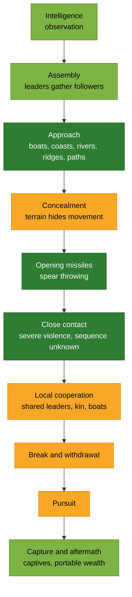
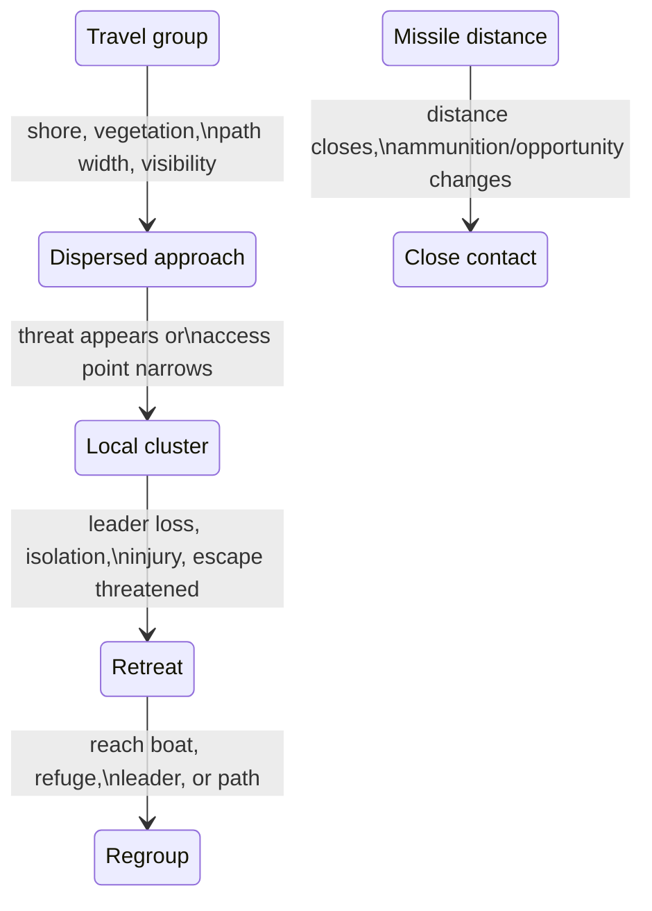

# Deep Past, Depth 3: Formations and Tactics

## Purpose

This document asks the most important formation question first: **what spatial
arrangements does the deep-past evidence actually preserve?**

The answer is narrower than a conventional military history. Archaeology
supports fortified positions, maritime mobility, some weapon categories, and
violent encounters. It does not preserve a Philippine equivalent of a phalanx
diagram, drill book, named formation, or battlefield map.

Navigate:

- [Depth 1: Overall warfare](01-deep-past-overall-warfare.md)
- [Depth 2: Forces and command](02-deep-past-forces-and-command.md)
- [Depth 4: Individual combat](04-deep-past-individual-combat.md)

## Evidence labels

- **Attested** — directly present in relevant material or linguistic evidence.
- **Strong reconstruction** — supported by multiple independent constraints.
- **Plausible inference** — physically and contextually possible but
  unobserved.
- **Unknown or unsupported** — absent from the current evidence.

Node color for these four tiers repeats in every diagram below. Left is best
supported, right is design space — it is a confidence spectrum, not a claimed
sequence.

## Formation evidence: the short answer

### Attested

- Some Batanes communities occupied or used elevated, fortified *ijang*
  ([Lacsina 2009](https://pages.upd.edu.ph/sites/default/files/asp/files/lacsina_thesis.pdf)).
- Plank-built boats moved people and goods through the Butuan riverine/coastal
  environment by the eighth to tenth centuries CE
  ([National Museum 2022](https://www.nationalmuseum.gov.ph/2022/10/24/preserving-our-heritage-towards-the-future-of-our-museums/)).
- Metal spearheads existed in Metal Age collections
  ([National Museum tools](https://www.nationalmuseum.gov.ph/our-collections/archaeology/tools/)).
- A reconstructed Proto-Philippine word, `*bákal`, connects war with spearing
  or throwing a spear, with stated semantic uncertainty
  ([ACD `*bákal`](https://acd.clld.org/cognatesets/33998)).
- Late Tanjay burials include trauma and unusual cranial deposits consistent
  with interpersonal violence, although the event and mortuary interpretation
  remain disputed
  ([Junker 1999](https://www.jstor.org/stable/29792432);
  [Aure 2004](https://www.jstor.org/stable/29792554)).

### Not attested

- regular files or ranks;
- fixed frontage and depth;
- a shield wall;
- a spear block;
- a bow or javelin screen;
- cavalry;
- a formal reserve;
- encirclement doctrine;
- alternating missile and melee lines;
- named naval formations;
- coordinated boarding sections;
- standardized dueling lanes; or
- an archipelago-wide formation system.

These unsupported items must not be introduced with phrases such as "the
ancient Filipinos formed..." A game may invent readable group states, but the
synthesis must label those as simulation abstractions.

## What archaeology can reveal about geometry

Archaeology is stronger at reconstructing **places and constraints** than
momentary human alignments.

| Material pattern | What it can support | What it cannot recover |
| --- | --- | --- |
| Elevated fortified settlement | Defenders valued a position with restricted or difficult approaches. | Wall-manning intervals, weapon assignments, gate drill, or defender count. |
| Boat remains in a river system | Groups could travel and concentrate by water. | Warship status, deck formation, fleet line, or boarding order. |
| Spearheads | Pointed weapons were made and deposited. | Whether users stood shoulder-to-shoulder, threw in volleys, or fenced individually. |
| Traumatic skeletal injury | At least some people suffered severe violence. | Attacker count, weapon sequence, stance, pursuit, or formation. |
| Ranked settlements and burials | Social inequality and political centers existed. | Exact battlefield command hierarchy. |

## Tactics by strategic setting

### Fortified high ground: Batanes

**Attested:** *Ijang* are fortified hilltop settlements or refuge places in the
Batanes archaeological and ethnohistorical record. Bellwood and Dizon's
open-access monograph supplies a multi-phase regional sequence rather than
treating every visible feature as equally old
([2013](https://doi.org/10.22459/TA40.12.2013)).

**Strong reconstruction:**

- height expands observation and makes unseen approach harder;
- steep or restricted access reduces the frontage available to attackers;
- a prepared refuge lets defenders concentrate at a place chosen in advance;
- attackers must spend time and energy climbing or negotiating obstacles; and
- defenders can use the settlement's edge and access points as force
  multipliers.

**Plausible inference:** Defenders may have watched likely approaches, occupied
choke points, and shifted people toward a threatened access route.

**Unknown or unsupported:** parapet drill, missile volleys, rolling stones,
gate-sally tactics, siege duration, water-denial tactics, or a standardized
defensive formation.

### Riverine and coastal approach

**Attested capability:** Butuan boats establish coordinated water transport,
not combat use.

**Strong reconstruction:** Embarkation, navigation, landing, and keeping boats
available shaped the operational geometry. A boat group creates natural
contingents because the people in each hull share transport, timing, and risk.

**Plausible inference:**

- multiple boats could approach separately and converge near an objective;
- a landing compresses movement around usable shore;
- attackers could seek an unobserved or weakly defended landing place;
- retaining boats preserves an escape route; and
- loss or separation of boats could fragment a coalition.

**Unknown or unsupported:** line-abreast fleets, ramming, circling, missile
exchanges between vessels, boarding doctrine, or assigned deck positions.

### Settlement attack

**Strong reconstruction, late Tanjay political model:** Raiding placed
inhabitants, portable wealth, stores, and high-status property at risk.
Junker's broader argument links intensified trade competition, slave raiding,
fortification, and political growth in some sixth- to sixteenth-century
chiefdoms
([Junker, "Trade Competition, Conflict, and Political
Transformations"](https://core.ac.uk/download/pdf/5105319.pdf)).

**Plausible inference:** Surprise and rapid access would help an attacker seize
people or goods before defenders concentrated. A delayed assault would give
inhabitants time to flee, fortify, or assemble.

**Unknown or unsupported:** a standard dawn attack, house-burning procedure,
street-clearing method, preplanned encirclement, or fixed division between
assault and capture teams.

### Forest, ridge, and path

Broken terrain changes visibility and movement. That mechanical fact supports
dispersed movement and local decision-making as **plausible inferences**.

The ACD reconstructs Proto-Philippine `*apat`, "lie in wait, set an ambush in
hunting game"
([ACD Proto-Philippine index](https://ling.lll.hawaii.edu/dicts/ACD/acd-pl_pph.htm)).
The explicit hunting meaning shows that concealment and waiting were old
concepts; it does **not** attest a military ambush doctrine.

Therefore:

- using concealment before contact is **plausible inference**;
- treating forest terrain as a visibility and cohesion constraint is
  **strong mechanical reconstruction**; and
- claiming a named or standardized ambush formation is **unknown or
  unsupported**.

### Open ground and the "huge battlefield"

Open ground permits more participants to see and engage one another, but no
deep-past source establishes how large Philippine forces arrayed themselves
there.

The minimum defensible geometry is:

- several contingents with stronger internal than cross-contingent cohesion;
- irregular spacing caused by movement, terrain, and weapon reach;
- leaders embedded within or near their own followers;
- local advance, hesitation, and withdrawal rather than perfectly simultaneous
  army-wide motion; and
- increasing command friction with distance and crowd size.

Every item above is a **plausible inference from coalition organization**, not
a recovered formation.

Drawn as a DAG — how a unit's behavior differs by setting, with no edge
between settings and no back-edge implying return to an earlier state:

Every node is a bullet already stated in "Tactics by strategic setting" above,
colored by its own evidence tier. Five separate roots, not one merged tree —
the source never claims a unit trained under one setting behaves the same way
under another.

## Battle phases: evidence audit

| Phase | Defensible deep-past statement | Evidence label |
| --- | --- | --- |
| Intelligence | Communities could observe routes and react to threat; fortified height helps observation. | **Strong reconstruction** for observation; methods unknown |
| Assembly | Leaders could gather followers and allies through personal networks. | **Strong reconstruction**, late chiefdom contexts |
| Approach | Boats, coasts, rivers, ridges, and paths constrained movement. | **Attested capability / strong reconstruction** |
| Concealment | Terrain could hide movement. | **Plausible inference** |
| Opening missiles | Spear throwing has linguistic support; no volley system is known. | **Attested linguistic reconstruction**, tactic unknown |
| Close contact | Severe violence occurred; pointed and cutting implements existed. | **Attested at broad level**, sequence unknown |
| Local cooperation | People sharing leaders, kin ties, or boats could coordinate. | **Plausible inference** |
| Break and withdrawal | Self-preserving withdrawal is humanly plausible. | **Plausible inference**, procedures unknown |
| Pursuit | A victor could pursue people or portable objectives. | **Plausible inference**, method unknown |
| Capture and aftermath | Late chiefdom models give captives and portable wealth strategic value. | **Strong reconstruction**, regional/period-limited |

Arrows mirror the row order above; node color is each phase's evidence tier,
not a claim about duration or how tightly one phase causes the next.

This table is deliberately asymmetrical. The approach and political context
are better supported than the few minutes of weapon contact.

## Candidate group arrangements

### 1. Boat contingent

**Historical basis:** shared transport.

**Safe interpretation:** people who arrive in one boat begin as a practical
group and may remain mutually aware.

**Do not claim:** an attested squad size or naval tactical unit.

### 2. Leader-centered cluster

**Historical basis:** personalized alliance and following.

**Safe interpretation:** followers orient to a known leader; the leader's
movement or loss affects local cohesion.

**Do not claim:** a circular formation, bodyguard ring, or exact radius.

### 3. Access-point defense

**Historical basis:** *ijang* and restricted approaches.

**Safe interpretation:** defenders concentrate where terrain lets attackers
enter.

**Do not claim:** a shield wall or fixed rank depth.

### 4. Loose missile-capable frontage

**Historical basis:** thrown-spear vocabulary and spearheads.

**Safe interpretation:** individuals require space and line of sight to throw.

**Do not claim:** synchronized volleys, dedicated skirmisher class, or
replacement drill.

### 5. Close-contact cluster

**Historical basis:** violence and short-range weapon affordances.

**Safe interpretation:** contact produces temporary local numerical
advantages, interference, and crowding.

**Do not claim:** choreographed paired duels or formal melee lanes.

No arrows between the five boxes — they are independent envelopes, not a
sequence. Drawing an order between them would assert something the sources
don't.

These arrangements are **simulation-safe envelopes**, not historical names.

## Small-unit cooperation

The evidence supports cooperation more confidently than any specific maneuver.
Building and operating boats, constructing settlements, feasting, and
coalition politics all required coordinated action.

The following combat behaviors are therefore **plausible inferences**:

- maintaining awareness of nearby companions;
- avoiding blocking a companion's movement or weapon;
- concentrating on an immediate threat;
- following a local leader's advance or withdrawal;
- using terrain to limit how many opponents can engage;
- helping protect an injured or high-status companion; and
- regrouping around a boat, access point, or leader.

No deep-past source tells us how these behaviors were taught or named.

## Formation transitions

A future simulation may need state changes, but the historical source only
supports broad pressures:

| Transition | Historically grounded pressure | Status |
| --- | --- | --- |
| Travel group -> dispersed approach | Shore, vegetation, path width, and visibility | **Strong mechanical reconstruction** |
| Dispersed approach -> local cluster | Threat appears or an access point narrows | **Plausible inference** |
| Missile distance -> close contact | Distance closes, ammunition/opportunity changes | **Plausible inference** |
| Local cluster -> retreat | Leader loss, isolation, injury, or escape route threatened | **Plausible inference** |
| Retreat -> regroup | Reach a boat, refuge, leader, or defensible path | **Plausible inference** |

`MissileDistance` has no incoming arrow on purpose — the table gives no
pressure for what precedes it, so the gap stays visible instead of being
quietly filled in.

Exact thresholds, timings, and shapes are design inventions.

## Formations Hukbo should not present as historical

Unless new direct evidence is found, do not label these as pre-contact
Philippine facts:

- phalanx-like spear square;
- Roman-style shield testudo;
- European pike block;
- ranked firing line;
- formal wedge;
- checkerboard infantry system;
- cavalry wing;
- dedicated skirmisher screen;
- standardized naval line or crescent;
- national "barangay formation"; or
- ritualized one-on-one duel replacing group battle.

They may be readable game mechanics only if named generically and marked as
design abstractions.

## Source criticism

- **Fortifications constrain but do not choreograph.** An *ijang* makes some
  approaches harder; it does not specify defender posture.
- **Transport groups are not tactical units by default.** A boat can carry a
  trading party, family, labor group, or fighters.
- **Lexical reconstruction is not a drill manual.** `*bákal` supports a
  spear-and-war semantic association, not volley timing.
- **Burials are after-action deposits.** They do not preserve the moment or
  side of combat, and Aure demonstrates that their interpretation is
  contestable.
- **Later parallels must remain later.** Sixteenth-century descriptions and
  modern martial arts cannot silently fill deep-past tactical gaps.

## Planning takeaways

- Prefer **terrain states** (`on high ground`, `at restricted access`,
  `landing`, `dispersed in low visibility`) over invented historical formation
  names.
- Prefer **contingent cohesion** and **leader orientation** over perfect
  army-wide alignment.
- Allow formations to be **emergent local geometry**, not rigid templates.
- Treat missile opening, flanking, pursuit, and withdrawal as possible
  behaviors whose exact historical frequency is unknown.
- Make "no known formation" an explicit result. It prevents a future agent
  from laundering familiar foreign drill into the deep-past track.

## Bibliography

1. Aure, Bonn. 2004. ["Archaeological Inference and Another Look at Junker's
   Mass Burial."](https://www.jstor.org/stable/29792554) *Philippine Quarterly
   of Culture and Society* 32(2): 161-177.
2. Bellwood, Peter, and Eusebio Dizon, eds. 2013. [*4000 Years of Migration
   and Cultural Exchange*.](https://doi.org/10.22459/TA40.12.2013) Canberra:
   ANU Press.
3. Blust, Robert, Stephen Trussel, Alexander D. Smith, and Robert Forkel, eds.
   [*Austronesian Comparative Dictionary*.](https://acd.clld.org/) Accessed
   2026-07-27.
4. Junker, Laura Lee. 1999. ["Warrior Burials and the Nature of Warfare in
   Prehispanic Philippine Chiefdoms."](https://www.jstor.org/stable/29792432)
   *Philippine Quarterly of Culture and Society* 27(1/2): 24-58.
5. Junker, Laura Lee. 1999. [*Raiding, Trading, and
   Feasting*.](https://www.jstor.org/stable/j.ctt6wr1cq) Honolulu: University
   of Hawai'i Press.
6. Junker, Laura Lee. 1994. ["Trade Competition, Conflict, and Political
   Transformations in Sixth- to Sixteenth-Century Philippine
   Chiefdoms."](https://www.jstor.org/stable/42928321) *Asian Perspectives*
   33(2): 229-260. [Open full-text
   copy.](https://core.ac.uk/download/pdf/5105319.pdf)
7. Lacsina, Ligaya S. P. 2009. [*The Ijang Sites of Batanes, Northern
   Philippines*.](https://pages.upd.edu.ph/sites/default/files/asp/files/lacsina_thesis.pdf)
   MA thesis, University of the Philippines.
8. National Museum of the Philippines. ["Tools."](https://www.nationalmuseum.gov.ph/our-collections/archaeology/tools/)
   Accessed 2026-07-27.
9. National Museum of the Philippines. 2022. ["Preserving Our Heritage Towards
   the Future of Our
   Museums."](https://www.nationalmuseum.gov.ph/2022/10/24/preserving-our-heritage-towards-the-future-of-our-museums/)
