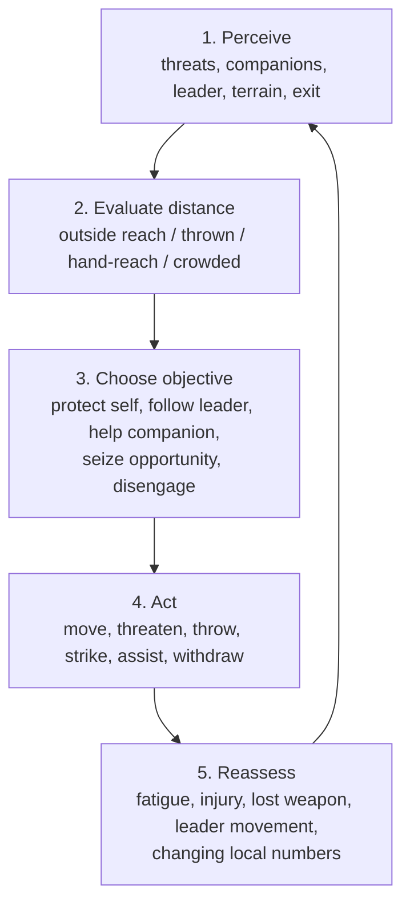

# Deep Past, Depth 4: Individual Combat

## Purpose

This document reaches the finest scale that the deep-past evidence can
support: the individual person's perception, equipment, movement,
cooperation, injury risk, and possible combat attributes.

At this depth, detail must not be mistaken for certainty. Archaeological
objects preserve **affordances**—what a form makes possible—not a complete
fighting method. No pre-1521 manual or eyewitness account records footwork,
guards, combinations, shield angles, training drills, or formal duel rules in
the archipelago.

Navigate:

- [Depth 1: Overall warfare](01-deep-past-overall-warfare.md)
- [Depth 2: Forces and command](02-deep-past-forces-and-command.md)
- [Depth 3: Formations and tactics](03-deep-past-formations-and-tactics.md)

## Evidence labels

- **Attested** — directly present in relevant material or linguistic evidence.
- **Strong reconstruction** — supported by independent constraints.
- **Plausible inference** — possible and contextually consistent, but not
  directly demonstrated.
- **Unknown or unsupported** — not recoverable from the present evidence.

Node color for these four tiers repeats in every diagram below. Left is best
supported, right is design space — it is a confidence spectrum, not a claimed
sequence.

## The individual evidence base

### Material weapons

**Attested:** Metal Age archaeological collections include adzes, spearheads,
and other metal tools from several regions. The National Museum identifies
examples from Bacong in Negros, Mulanay on the Bondoc Peninsula, and Maitum in
Mindanao
([National Museum tools collection](https://www.nationalmuseum.gov.ph/our-collections/archaeology/tools/)).

This demonstrates:

- knowledge of making or obtaining pointed and edged metal objects;
- regional circulation or deposition of such objects;
- the physical possibility of penetrating, cutting, or forceful impact; and
- in some contexts, the association of metal objects with mortuary identity.

It does not demonstrate that every metal implement was a weapon. Adzes,
knives, and axes can be tools and weapons without belonging to a specialized
martial system.

### Linguistic evidence for spear use

**Attested linguistic reconstruction:** The Austronesian Comparative
Dictionary reconstructs Proto-Philippine `*bákal` as "spear used in warfare;
throw a spear at someone." Its reflexes range from "war" and "battle" to
spearing, throwing, and "iron," and the editors explicitly discuss the
semantic uncertainty
([ACD `*bákal`](https://acd.clld.org/cognatesets/33998)).

The safe conclusion is that spear-related fighting, including throwing, has
deep linguistic support. The unsafe conclusion is a specific javelin length,
grip, volley drill, or regional distribution.

### Bodies and violent death

**Attested, late Tanjay:** Some human remains show severe cranial or spinal
trauma; detached crania occur in unusual burial contexts
([Junker 1999](https://www.jstor.org/stable/29792432)).

**Disputed:** Junker links these contexts to war, raiding, revenge, and
head-taking. Aure argues that the mass grave's ritual and depositional meaning
is not uniquely determined and offers an alternative witch-killing
interpretation
([Aure 2004](https://www.jstor.org/stable/29792554)).

The remains demonstrate that severe interpersonal violence occurred. They do
not recover:

- the attacker's stance;
- whether one or several people struck;
- the precise weapon;
- whether the victim defended, fled, or was restrained;
- whether the violence occurred in battle;
- the number of preceding non-bone-damaging wounds; or
- how quickly the injury disabled or killed.

### Perishable equipment

**Unknown or unsupported at useful detail:** Wood, fiber, leather, hide,
cordage, and textiles decay. The deep-past record used here cannot establish
shield dimensions, armor coverage, bow design, quiver arrangement, or carrying
systems across the archipelago.

Absence of surviving organic equipment is not evidence of absence. Conversely,
later museum objects and early-contact descriptions are not proof that
identical equipment existed in the same form centuries earlier.

## Distance bands

The following bands are a **simulation abstraction based on weapon
affordances**, not indigenous terminology:

| Band | What an individual must solve | Deep-past support |
| --- | --- | --- |
| Observation | Detect people, movement, routes, and threat before weapons can reach. | **Strong general constraint**; methods unknown |
| Thrown-weapon distance | Judge whether a thrown spear can reach with useful force and accuracy. | **Attested linguistic association**; exact range unknown |
| Long hand-weapon distance | Use a shaft or point while keeping the body farther from contact. | **Plausible affordance** of a spear |
| Close contact | Manage crowding, edged or pointed tools, grappling risk, and multiple directions. | **Attested violence / plausible mechanics** |
| Disengagement | Create enough distance to flee, regroup, reach a boat, or use terrain. | **Plausible inference** |

Double-headed arrows because a fighter can close or open distance in either
direction. No meter values are implied — see the caution below the table.

No historical meter values should be assigned from these sources. Weapon
length, user stature, footing, vegetation, fatigue, and nearby bodies all
change effective distance.

## Weapon affordances, not techniques

### Spear or javelin

**Supported affordances:**

- threaten at greater reach than a short hand tool;
- thrust toward a target;
- throw in at least some linguistic contexts;
- use a point to concentrate force; and
- keep or lose the weapon after throwing, depending on circumstances.

**Plausible individual judgments:**

- preserve distance from a shorter weapon;
- choose between retaining and throwing;
- avoid entangling the shaft with companions or terrain;
- recover, replace, or abandon a thrown weapon; and
- turn the point toward a newly appearing threat.

**Unknown or unsupported:** hand position, guard, dominant stance, overarm
versus underarm frequency, feints, butt strikes, two-handed doctrine, and
formal spear schools.

### Edged metal tool or blade

**Supported affordance:** An edged object can cut; some pointed forms can also
thrust. Metal access and craftsmanship varied.

**Plausible individual judgments:** close enough to use the edge while avoiding
the opponent's point; choose a reachable target; withdraw the weapon; and
avoid striking a companion.

**Unknown or unsupported:** named blade type, exact balance, preferred target,
combination, parry system, or whether a specific excavated object was carried
primarily for war.

### Shield

**Unknown in this deep-past source set:** Shield use is richly visible in
early-contact and later evidence, but no cited deep-past find here establishes
a standard shield.

**Simulation boundary:** A shield may be included in an explicitly
reconstructed loadout if another period-specific source justifies it. Its
coverage, directional protection, durability, and technique must remain design
choices, not facts derived from the deep-past archaeology.

### Bow, blowgun, firearm, and artillery

These are documented in the
[sixteenth-century weapons research](../HISTORICAL_1500s_WEAPONS.md), not in
the deep-past evidence assembled here. Do not transfer them backward merely to
fill roles in a roster. Each requires independent pre-1521 evidence for the
time and region being modeled.

## Movement and footwork

### Supported constraints

An individual had to cope with:

- uneven, wet, steep, sandy, or vegetated footing;
- narrow paths, restricted fortified approaches, and boat edges;
- reduced visibility in vegetation or crowds;
- weapon reach and recovery;
- nearby companions who could obstruct movement;
- fatigue from travel before contact; and
- the need to preserve an escape or regrouping route.

These are **strong mechanical reconstructions** because terrain, boats,
fortified elevation, and human physiology impose them.

### Plausible behaviors

- shorten steps on uncertain footing;
- turn or reposition to keep a threat visible;
- avoid being trapped against an edge or obstacle;
- use a companion or choke point to limit exposure;
- advance when a local numerical advantage appears;
- withdraw when isolated; and
- orient toward a known leader, boat, or refuge.

These are **plausible inferences**, not recorded techniques.

### Unsupported choreography

Do not claim:

- a universal bladed stance;
- triangular footwork as an unchanged ancient survival;
- a named numbering system;
- standardized checking-hand behavior;
- disarms, locks, or throws as a common battlefield curriculum;
- preset combinations;
- ritual salutes; or
- modern Filipino martial arts as direct evidence of pre-1521 practice.

Continuity must be demonstrated historically, not assumed from a present-day
name or geographic location.

## Perception and decision-making

Individual combat is not only weapon motion. A person must select information
under time pressure.

| Capacity | Why it matters | Evidence status |
| --- | --- | --- |
| Threat awareness | Detect approaching people, thrown objects, terrain hazards, and changes nearby. | **Strong universal constraint** |
| Distance judgment | Decide whether to throw, thrust, close, or disengage. | **Strong mechanical reconstruction** |
| Terrain reading | Use or avoid slope, path, vegetation, shore, and obstacles. | **Strong reconstruction** from known environments |
| Companion awareness | Avoid interference and exploit local cooperation. | **Plausible inference** |
| Leader orientation | Maintain contact with the person or group anchoring cohesion. | **Plausible inference** from personalized organization |
| Target selection | Choose an immediate threat or opportunity. | **Strong universal constraint**; historical priorities unknown |
| Risk judgment | Balance objective, reputation, survival, and escape. | **Plausible inference** |

The evidence does not supply perception radii, reaction times, or universal
target priorities.

## One-versus-one fighting

### What is supported

**Plausible inference:** Within a raid, settlement defense, landing, pursuit,
or melee, two opponents could become each other's immediate threat. A local
one-versus-one exchange can therefore occur as an emergent battlefield state.

### What is not supported

**Unknown or unsupported:**

- a formal pre-battle champion duel;
- ritual rules guaranteeing noninterference;
- a universal honor code requiring equal weapons;
- a duel referee or bounded dueling ground;
- a standardized sequence of challenge, exchange, and surrender; or
- evidence that group warfare normally dissolved into isolated pairs.

A game should treat one-versus-one as a temporary local geometry. Nearby
fighters, missiles, terrain, and the larger objective remain relevant. A
fighter who ignores a second threat in order to preserve a "fair duel" would
be following a game rule, not a known deep-past rule.

## Many-versus-one and cooperation

**Plausible inference:** Group conflict creates unequal local numbers. People
could converge on an isolated opponent, protect a leader, or disengage when
outnumbered.

Historically cautious behaviors include:

- avoid surrounding a companion so tightly that weapons collide;
- approach from different available directions;
- maintain escape space;
- shift attention when a second opponent enters reach;
- prefer survival and group objective over prolonged paired exchange; and
- regroup with known companions after separation.

Exact coordination, signals, and ethical rules remain unknown.

## Training and experience

### What can be inferred

**Strong reconstruction:** Operating boats, making or maintaining weapons,
hunting, traveling through local terrain, and collective labor all required
learned practical skills.

**Plausible inference:** Some people accumulated more experience with
dangerous expeditions, weapons, and leadership than others. Unequal mortuary
display and political status are compatible with socially valued martial
reputation in late Tanjay, but the archaeological interpretation is not
unambiguous.

### What cannot be reconstructed

- age at first training;
- teacher-student institutions;
- daily drill;
- sparring format;
- weapon curriculum;
- skill ranks;
- certification;
- proportion of experienced fighters; and
- whether specialist warriors trained differently from other participants.

Use **weapon familiarity** and **combat experience** as broad variables only.
Do not name them after modern martial arts or assign source-derived numeric
levels.

## Courage, aggression, and self-preservation

Junker's late-chiefdom model makes martial reputation and successful
leadership politically meaningful. That supports **plausible variation** in:

- willingness to approach danger;
- persistence after a setback;
- responsiveness to a leader;
- concern for reputation;
- desire for capture or portable gain; and
- retreat when the expected benefit collapses.

It does not support an ethnic or national "bravery bonus." Courage is a
person-and-situation variable. Aggression is not the same as skill, cohesion,
or willingness to die.

## Fatigue, injury, and impairment

### Fatigue

**Strong physiological constraint:** Paddling, carrying equipment, climbing,
running, throwing, and close combat consume energy. Heat, hydration, travel
time, and footing matter.

**Unknown or unsupported:** historical recovery rates, march speeds, burden
weights, or stamina differences among social groups.

### Injury

**Attested:** Severe skeletal trauma occurred in late Tanjay.

**Strong mechanical reconstruction:** Wounds can reduce movement, grip,
awareness, willingness to continue, and survival.

**Unknown or unsupported:** body-part hit frequencies, weapon-specific damage
tables, bleeding rates, pain tolerance, treatment, and time to incapacitation.
The current Hukbo combat preset is a gameplay system, not measured historical
physiology; see the boundary explained in
[`HISTORICAL_1500s_WEAPONS.md`](../HISTORICAL_1500s_WEAPONS.md#cross-reference-the-combat-targeting-preset-is-a-gameplay-model).

## Attribute and skill matrix

This matrix is intended for later planning. It does not prescribe final stats.

| Candidate attribute or skill | Historical rationale | Confidence | Do not infer |
| --- | --- | --- | --- |
| Awareness | Threat, terrain, and companions must be perceived. | **Strong constraint** | Exact sight radius or reaction time |
| Distance judgment | Spears require decisions about reach and throwing. | **Strong reconstruction** | Measured ranges from linguistic evidence |
| Weapon familiarity | Learned use and maintenance vary among people. | **Plausible inference** | Named schools or standardized levels |
| Terrain mobility | Slopes, paths, vegetation, shore, and boats change movement. | **Strong reconstruction** | One universal footwork system |
| Boat handling | Butuan boats demonstrate specialized cooperative technology. | **Attested capability**, regional | Every fighter is a sailor |
| Local cohesion | Personalized ties and shared transport can bind small groups. | **Plausible inference** | Permanent squad organization |
| Leader responsiveness | Chiefly authority and coalition politics affect action. | **Plausible inference** | Formal command radius |
| Courage / risk tolerance | Reputation and reward can affect willingness to fight. | **Plausible inference** | Ethnic personality bonus |
| Aggression | Individuals can differ in willingness to close or pursue. | **Design-safe human variation** | Greater aggression equals greater skill |
| Fatigue tolerance | Travel and combat impose physiological costs. | **Strong constraint** | Historical numeric stamina distribution |
| Injury tolerance | People differ, and wounds impair action. | **Strong general constraint** | Bone trauma yields a damage formula |
| Tactical judgment | A person must choose target, distance, and withdrawal. | **Strong general constraint** | Recovered doctrine or fixed priorities |
| Prestige / reputation | Late chiefdom politics made status and following consequential. | **Plausible inference**, context-specific | Visible universal rank insignia |

## Minimal individual decision loop

The following is a **game-planning abstraction** compatible with the evidence:

1. **Perceive:** immediate threats, companions, leader, terrain, and exit.
2. **Evaluate distance:** outside reach, thrown-weapon opportunity, hand-weapon
   reach, or crowded contact.
3. **Choose objective:** protect self, follow leader, help companion, seize an
   opportunity, or disengage.
4. **Act:** move, threaten, throw, strike, assist, or withdraw.
5. **Reassess:** account for fatigue, injury, lost weapon, leader movement, and
   changing local numbers.

Drawn as a loop because step 5 feeds back into step 1 on the next moment of
contact — a design abstraction, not a recovered five-step doctrine.

The loop above hides which action fits which distance. Unrolled into a DAG —
no back-edge, so band and action stay separated from the repeating cycle:

```mermaid
flowchart TD
    ROOT["Perceive threat"]:::design --> B1["Outside reach"]:::design
    ROOT --> B2["Thrown-weapon opportunity"]:::design
    ROOT --> B3["Hand-weapon reach"]:::design
    ROOT --> B4["Crowded contact"]:::design

    B1 --> A1["Move / reposition"]:::plausible
    B1 --> A2["Turn point toward<br/>a newly appearing threat"]:::plausible
    B1 --> A3["Preserve distance<br/>from a shorter weapon"]:::plausible

    B2 --> A4["Throw"]:::plausible
    B2 --> A5["Choose retain vs. throw"]:::plausible
    B2 --> A6["Recover, replace, or<br/>abandon thrown weapon"]:::plausible

    B3 --> A7["Thrust / strike"]:::plausible
    B3 --> A8["Avoid entangling shaft<br/>with companions or terrain"]:::plausible
    B3 --> A9["Close enough to use edge<br/>while avoiding opponent's point"]:::plausible

    B4 --> A10["Choose a reachable target"]:::plausible
    B4 --> A11["Assist / protect<br/>an injured or high-status companion"]:::plausible
    B4 --> A12["Withdraw"]:::plausible

    classDef design fill:#37474f,color:#fff,stroke:#263238
    classDef plausible fill:#f9a825,color:#000,stroke:#f57f17
```

Gray nodes are the "Evaluate distance" abstraction itself, not evidence-tiered.
Amber leaves are pulled from the "Plausible individual judgments" lists under
Weapon affordances and from the "Act" step above — nothing new. No edge
between the four bands: a unit can enter at any one depending on how the
encounter opens, not in a fixed left-to-right order.

No source proves that historical fighters conceptualized action in these five
steps. It is a transparent abstraction that avoids invented choreography.

## Explicit unknowns

The present evidence cannot recover:

- handedness norms;
- stance width or posture;
- feinting frequency;
- preferred anatomical targets;
- shield-hand technique;
- grappling curriculum;
- weapon combinations;
- attack cadence;
- reaction time;
- ammunition loads;
- formal duel rules;
- surrender gestures;
- treatment of wounded opponents;
- training age or duration; or
- reliable numerical distributions for any skill or attribute.

## Planning takeaways

- Build individual behavior around **perception, distance, terrain, local
  numbers, fatigue, and cohesion**.
- Use weapon shapes to define **possible actions**, not culturally specific
  animations unsupported by sources.
- Let one-versus-one encounters emerge inside group conflict; do not enforce a
  formal duel tradition.
- Keep experience, courage, aggression, and skill separate.
- Do not derive damage, reach, accuracy, armor, or fatigue numbers from
  archaeological labels.
- Treat modern martial arts as a separate research subject unless a precise
  continuity chain is demonstrated.

## Bibliography

1. Aure, Bonn. 2004. ["Archaeological Inference and Another Look at Junker's
   Mass Burial."](https://www.jstor.org/stable/29792554) *Philippine Quarterly
   of Culture and Society* 32(2): 161-177.
2. Blust, Robert, Stephen Trussel, Alexander D. Smith, and Robert Forkel, eds.
   ["`*bákal`: spear used in warfare; throw a spear at
   someone."](https://acd.clld.org/cognatesets/33998) *Austronesian
   Comparative Dictionary*. Accessed 2026-07-27.
3. Junker, Laura Lee. 1999. ["Warrior Burials and the Nature of Warfare in
   Prehispanic Philippine Chiefdoms."](https://www.jstor.org/stable/29792432)
   *Philippine Quarterly of Culture and Society* 27(1/2): 24-58.
4. Junker, Laura Lee. 1999. [*Raiding, Trading, and
   Feasting*.](https://www.jstor.org/stable/j.ctt6wr1cq) Honolulu: University
   of Hawai'i Press.
5. National Museum of the Philippines. ["Tools."](https://www.nationalmuseum.gov.ph/our-collections/archaeology/tools/)
   Accessed 2026-07-27.
6. National Museum of the Philippines. 2022. ["Preserving Our Heritage Towards
   the Future of Our
   Museums."](https://www.nationalmuseum.gov.ph/2022/10/24/preserving-our-heritage-towards-the-future-of-our-museums/)
